# Circle Country Flag Icons — Free SVG & PNG (271 Countries)

Free circle-shaped country flag icons for 271 countries. Transparent PNG in 64, 128, 256, 512px + SVG. Free for commercial use.

## Preview — All 271 Flags

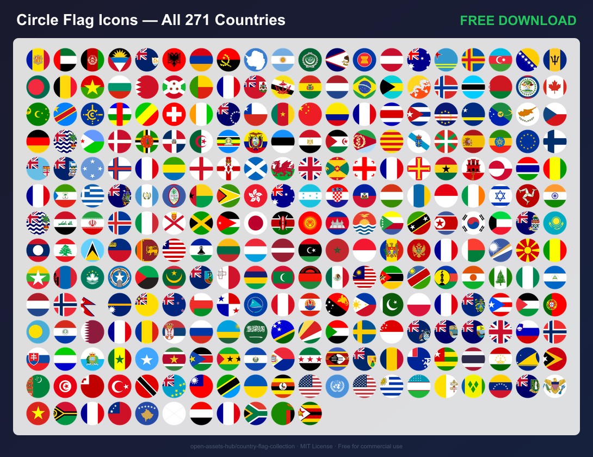

## All Flags

| | | | | | | | | | |
|---|---|---|---|---|---|---|---|---|---|
| [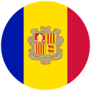](../countries/ad/) | [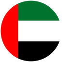](../countries/ae/) | [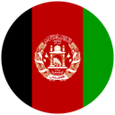](../countries/af/) | [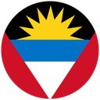](../countries/ag/) | [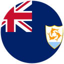](../countries/ai/) | [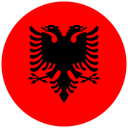](../countries/al/) | [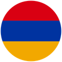](../countries/am/) |  | [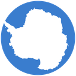](../countries/aq/) | [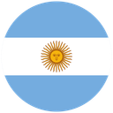](../countries/ar/) |
|  | [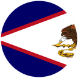](../countries/as/) |  | [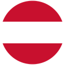](../countries/at/) |  | [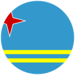](../countries/aw/) | [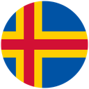](../countries/ax/) | [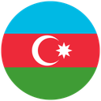](../countries/az/) | [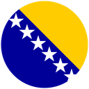](../countries/ba/) |  |
| [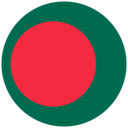](../countries/bd/) | [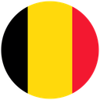](../countries/be/) | [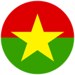](../countries/bf/) | [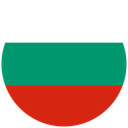](../countries/bg/) |  | [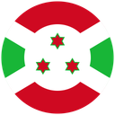](../countries/bi/) | [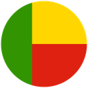](../countries/bj/) |  | [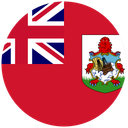](../countries/bm/) | [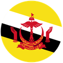](../countries/bn/) |
| [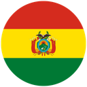](../countries/bo/) | [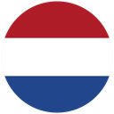](../countries/bq/) |  |  | [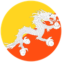](../countries/bt/) | [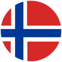](../countries/bv/) | [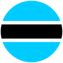](../countries/bw/) | [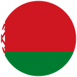](../countries/by/) | [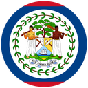](../countries/bz/) |  |
| [ Islands")](../countries/cc/) | [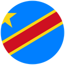](../countries/cd/) |  | [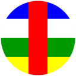](../countries/cf/) | [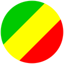](../countries/cg/) |  | [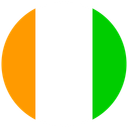](../countries/ci/) |  | [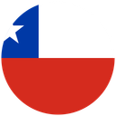](../countries/cl/) | [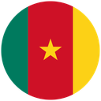](../countries/cm/) |
| [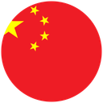](../countries/cn/) | [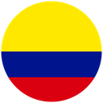](../countries/co/) |  | [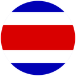](../countries/cr/) | [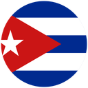](../countries/cu/) | [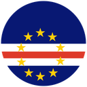](../countries/cv/) | [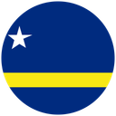](../countries/cw/) | [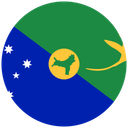](../countries/cx/) | [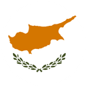](../countries/cy/) | [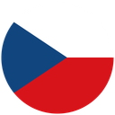](../countries/cz/) |
| [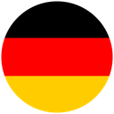](../countries/de/) |  |  | [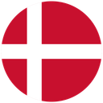](../countries/dk/) | [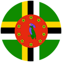](../countries/dm/) | [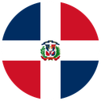](../countries/do/) |  |  |  |  |
|  |  |  |  |  |  |  |  |  |  |
|  | [")](../countries/fk/) |  |  |  |  |  |  |  |  |
|  |  |  |  |  |  |  |  |  |  |
|  |  |  |  |  |  |  |  |  |  |
|  |  |  |  |  |  |  |  |  |  |
|  |  |  |  |  |  |  |  |  |  |
|  |  |  |  |  |  |  |  |  |  |
|  |  |  |  |  |  |  |  |  |  |
|  |  |  |  |  | [")](../countries/mf/) |  |  |  |  |
|  |  |  |  |  |  |  |  |  |  |
|  |  |  |  |  |  |  |  |  |  |
|  |  |  |  |  |  |  |  |  |  |
|  |  |  |  |  |  |  |  |  |  |
|  |  |  |  |  |  |  |  |  |  |
|  |  |  |  |  |  |  |  |  |  |
|  |  |  |  |  |  |  |  |  | [")](../countries/sx/) |
|  |  |  |  |  |  |  |  |  |  |
|  |  |  |  |  |  |  |  |  |  |
|  |  |  |  |  |  |  |  | [")](../countries/vg/) | [")](../countries/vi/) |
|  |  |  |  |  |  |  |  |  |  |
|  |  |  |  |  |  |  |  |  |  |

## Download

| Format | Size | Download |
|---|---|---|
| SVG | vector | [circle-svg.zip](https://github.com/open-assets-hub/country-flag-collection/releases/download/circle-v1.0.0/circle-svg.zip) |
| PNG 64px | 64×64 | [circle-64.zip](https://github.com/open-assets-hub/country-flag-collection/releases/download/circle-v1.0.0/circle-64.zip) |
| PNG 128px | 128×128 | [circle-128.zip](https://github.com/open-assets-hub/country-flag-collection/releases/download/circle-v1.0.0/circle-128.zip) |
| PNG 256px | 256×256 | [circle-256.zip](https://github.com/open-assets-hub/country-flag-collection/releases/download/circle-v1.0.0/circle-256.zip) |
| PNG 512px | 512×512 | [circle-512.zip](https://github.com/open-assets-hub/country-flag-collection/releases/download/circle-v1.0.0/circle-512.zip) |
| **All sizes** | SVG + PNG | [**circle-full.zip**](https://github.com/open-assets-hub/country-flag-collection/releases/download/circle-v1.0.0/circle-full.zip) |

## License

Flag SVGs from [lipis/flag-icons](https://github.com/lipis/flag-icons) (MIT License). Free for personal and commercial use.

[← All shapes](../README.md)
