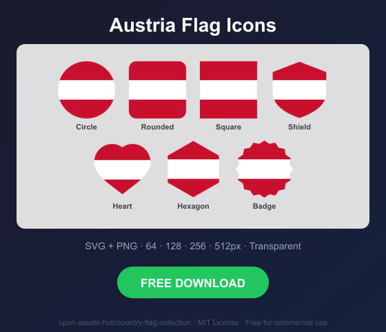
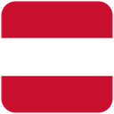
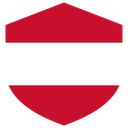
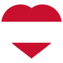
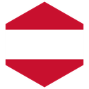

# Austria Flag Icons — Free SVG & PNG in 7 Shapes

Free Austria flag icons in 7 shapes. Transparent PNG (64, 128, 256, 512px) + SVG. Free for commercial use.

## Preview

      

## Download All Shapes

**[Download at-flag-icons.zip](at-flag-icons.zip)** — All 7 shapes, all sizes + SVG in one zip

## Download Individual

| Shape | SVG | 64px | 128px | 256px | 512px |
|---|---|---|---|---|---|
| Circle | [SVG](https://raw.githubusercontent.com/open-assets-hub/country-flag-collection/main/circle/svg/at.svg) | [64](https://raw.githubusercontent.com/open-assets-hub/country-flag-collection/main/circle/64/at.png) | [128](https://raw.githubusercontent.com/open-assets-hub/country-flag-collection/main/circle/128/at.png) | [256](https://raw.githubusercontent.com/open-assets-hub/country-flag-collection/main/circle/256/at.png) | [512](https://raw.githubusercontent.com/open-assets-hub/country-flag-collection/main/circle/512/at.png) |
| Rounded | [SVG](https://raw.githubusercontent.com/open-assets-hub/country-flag-collection/main/rounded/svg/at.svg) | [64](https://raw.githubusercontent.com/open-assets-hub/country-flag-collection/main/rounded/64/at.png) | [128](https://raw.githubusercontent.com/open-assets-hub/country-flag-collection/main/rounded/128/at.png) | [256](https://raw.githubusercontent.com/open-assets-hub/country-flag-collection/main/rounded/256/at.png) | [512](https://raw.githubusercontent.com/open-assets-hub/country-flag-collection/main/rounded/512/at.png) |
| Square | [SVG](https://raw.githubusercontent.com/open-assets-hub/country-flag-collection/main/square/svg/at.svg) | [64](https://raw.githubusercontent.com/open-assets-hub/country-flag-collection/main/square/64/at.png) | [128](https://raw.githubusercontent.com/open-assets-hub/country-flag-collection/main/square/128/at.png) | [256](https://raw.githubusercontent.com/open-assets-hub/country-flag-collection/main/square/256/at.png) | [512](https://raw.githubusercontent.com/open-assets-hub/country-flag-collection/main/square/512/at.png) |
| Shield | [SVG](https://raw.githubusercontent.com/open-assets-hub/country-flag-collection/main/shield/svg/at.svg) | [64](https://raw.githubusercontent.com/open-assets-hub/country-flag-collection/main/shield/64/at.png) | [128](https://raw.githubusercontent.com/open-assets-hub/country-flag-collection/main/shield/128/at.png) | [256](https://raw.githubusercontent.com/open-assets-hub/country-flag-collection/main/shield/256/at.png) | [512](https://raw.githubusercontent.com/open-assets-hub/country-flag-collection/main/shield/512/at.png) |
| Heart | [SVG](https://raw.githubusercontent.com/open-assets-hub/country-flag-collection/main/heart/svg/at.svg) | [64](https://raw.githubusercontent.com/open-assets-hub/country-flag-collection/main/heart/64/at.png) | [128](https://raw.githubusercontent.com/open-assets-hub/country-flag-collection/main/heart/128/at.png) | [256](https://raw.githubusercontent.com/open-assets-hub/country-flag-collection/main/heart/256/at.png) | [512](https://raw.githubusercontent.com/open-assets-hub/country-flag-collection/main/heart/512/at.png) |
| Hexagon | [SVG](https://raw.githubusercontent.com/open-assets-hub/country-flag-collection/main/hexagon/svg/at.svg) | [64](https://raw.githubusercontent.com/open-assets-hub/country-flag-collection/main/hexagon/64/at.png) | [128](https://raw.githubusercontent.com/open-assets-hub/country-flag-collection/main/hexagon/128/at.png) | [256](https://raw.githubusercontent.com/open-assets-hub/country-flag-collection/main/hexagon/256/at.png) | [512](https://raw.githubusercontent.com/open-assets-hub/country-flag-collection/main/hexagon/512/at.png) |
| Badge | [SVG](https://raw.githubusercontent.com/open-assets-hub/country-flag-collection/main/badge/svg/at.svg) | [64](https://raw.githubusercontent.com/open-assets-hub/country-flag-collection/main/badge/64/at.png) | [128](https://raw.githubusercontent.com/open-assets-hub/country-flag-collection/main/badge/128/at.png) | [256](https://raw.githubusercontent.com/open-assets-hub/country-flag-collection/main/badge/256/at.png) | [512](https://raw.githubusercontent.com/open-assets-hub/country-flag-collection/main/badge/512/at.png) |

## Keywords

Austria flag icon, Austria flag png, Austria flag svg, Austria flag circle,
Austria flag rounded, Austria flag shield, Austria flag heart,
AT flag icon, free Austria flag download, Austria flag transparent png

[← All countries](../../README.md)
