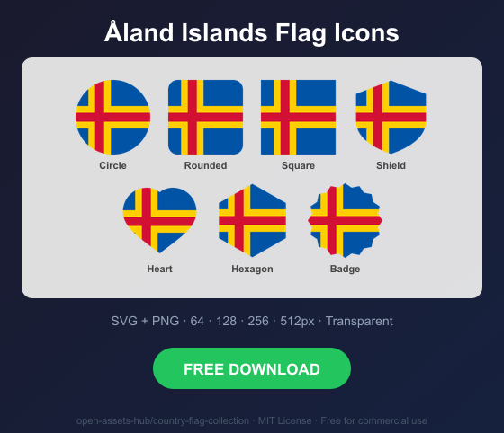
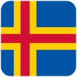
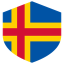
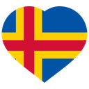
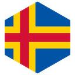
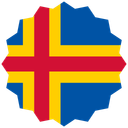

# Åland Islands Flag Icons — Free SVG & PNG in 7 Shapes

Free Åland Islands flag icons in 7 shapes. Transparent PNG (64, 128, 256, 512px) + SVG. Free for commercial use.

## Preview

      

## Download All Shapes

**[Download ax-flag-icons.zip](https://raw.githubusercontent.com/open-assets-hub/country-flag-collection/main/countries/ax/ax-flag-icons.zip)** — All 7 shapes, all sizes + SVG in one zip

## Download Individual

| Shape | SVG | 64px | 128px | 256px | 512px |
|---|---|---|---|---|---|
| Circle | [SVG](https://raw.githubusercontent.com/open-assets-hub/country-flag-collection/main/circle/svg/ax.svg) | [64](https://raw.githubusercontent.com/open-assets-hub/country-flag-collection/main/circle/64/ax.png) | [128](https://raw.githubusercontent.com/open-assets-hub/country-flag-collection/main/circle/128/ax.png) | [256](https://raw.githubusercontent.com/open-assets-hub/country-flag-collection/main/circle/256/ax.png) | [512](https://raw.githubusercontent.com/open-assets-hub/country-flag-collection/main/circle/512/ax.png) |
| Rounded | [SVG](https://raw.githubusercontent.com/open-assets-hub/country-flag-collection/main/rounded/svg/ax.svg) | [64](https://raw.githubusercontent.com/open-assets-hub/country-flag-collection/main/rounded/64/ax.png) | [128](https://raw.githubusercontent.com/open-assets-hub/country-flag-collection/main/rounded/128/ax.png) | [256](https://raw.githubusercontent.com/open-assets-hub/country-flag-collection/main/rounded/256/ax.png) | [512](https://raw.githubusercontent.com/open-assets-hub/country-flag-collection/main/rounded/512/ax.png) |
| Square | [SVG](https://raw.githubusercontent.com/open-assets-hub/country-flag-collection/main/square/svg/ax.svg) | [64](https://raw.githubusercontent.com/open-assets-hub/country-flag-collection/main/square/64/ax.png) | [128](https://raw.githubusercontent.com/open-assets-hub/country-flag-collection/main/square/128/ax.png) | [256](https://raw.githubusercontent.com/open-assets-hub/country-flag-collection/main/square/256/ax.png) | [512](https://raw.githubusercontent.com/open-assets-hub/country-flag-collection/main/square/512/ax.png) |
| Shield | [SVG](https://raw.githubusercontent.com/open-assets-hub/country-flag-collection/main/shield/svg/ax.svg) | [64](https://raw.githubusercontent.com/open-assets-hub/country-flag-collection/main/shield/64/ax.png) | [128](https://raw.githubusercontent.com/open-assets-hub/country-flag-collection/main/shield/128/ax.png) | [256](https://raw.githubusercontent.com/open-assets-hub/country-flag-collection/main/shield/256/ax.png) | [512](https://raw.githubusercontent.com/open-assets-hub/country-flag-collection/main/shield/512/ax.png) |
| Heart | [SVG](https://raw.githubusercontent.com/open-assets-hub/country-flag-collection/main/heart/svg/ax.svg) | [64](https://raw.githubusercontent.com/open-assets-hub/country-flag-collection/main/heart/64/ax.png) | [128](https://raw.githubusercontent.com/open-assets-hub/country-flag-collection/main/heart/128/ax.png) | [256](https://raw.githubusercontent.com/open-assets-hub/country-flag-collection/main/heart/256/ax.png) | [512](https://raw.githubusercontent.com/open-assets-hub/country-flag-collection/main/heart/512/ax.png) |
| Hexagon | [SVG](https://raw.githubusercontent.com/open-assets-hub/country-flag-collection/main/hexagon/svg/ax.svg) | [64](https://raw.githubusercontent.com/open-assets-hub/country-flag-collection/main/hexagon/64/ax.png) | [128](https://raw.githubusercontent.com/open-assets-hub/country-flag-collection/main/hexagon/128/ax.png) | [256](https://raw.githubusercontent.com/open-assets-hub/country-flag-collection/main/hexagon/256/ax.png) | [512](https://raw.githubusercontent.com/open-assets-hub/country-flag-collection/main/hexagon/512/ax.png) |
| Badge | [SVG](https://raw.githubusercontent.com/open-assets-hub/country-flag-collection/main/badge/svg/ax.svg) | [64](https://raw.githubusercontent.com/open-assets-hub/country-flag-collection/main/badge/64/ax.png) | [128](https://raw.githubusercontent.com/open-assets-hub/country-flag-collection/main/badge/128/ax.png) | [256](https://raw.githubusercontent.com/open-assets-hub/country-flag-collection/main/badge/256/ax.png) | [512](https://raw.githubusercontent.com/open-assets-hub/country-flag-collection/main/badge/512/ax.png) |

## Keywords

Åland Islands flag icon, Åland Islands flag png, Åland Islands flag svg, Åland Islands flag circle,
Åland Islands flag rounded, Åland Islands flag shield, Åland Islands flag heart,
AX flag icon, free Åland Islands flag download, Åland Islands flag transparent png

[← All countries](../../README.md)
