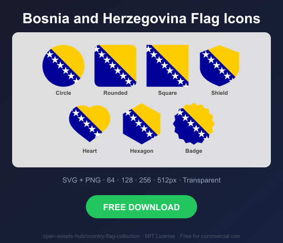
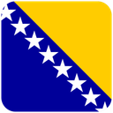
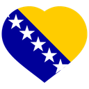
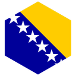
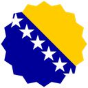

# Bosnia and Herzegovina Flag Icons — Free SVG & PNG in 7 Shapes

Free Bosnia and Herzegovina flag icons in 7 shapes. Transparent PNG (64, 128, 256, 512px) + SVG. Free for commercial use.

## Preview

      

## Download All Shapes

**[Download ba-flag-icons.zip](ba-flag-icons.zip)** — All 7 shapes, all sizes + SVG in one zip

## Download Individual

| Shape | SVG | 64px | 128px | 256px | 512px |
|---|---|---|---|---|---|
| Circle | [SVG](https://raw.githubusercontent.com/open-assets-hub/country-flag-collection/main/circle/svg/ba.svg) | [64](https://raw.githubusercontent.com/open-assets-hub/country-flag-collection/main/circle/64/ba.png) | [128](https://raw.githubusercontent.com/open-assets-hub/country-flag-collection/main/circle/128/ba.png) | [256](https://raw.githubusercontent.com/open-assets-hub/country-flag-collection/main/circle/256/ba.png) | [512](https://raw.githubusercontent.com/open-assets-hub/country-flag-collection/main/circle/512/ba.png) |
| Rounded | [SVG](https://raw.githubusercontent.com/open-assets-hub/country-flag-collection/main/rounded/svg/ba.svg) | [64](https://raw.githubusercontent.com/open-assets-hub/country-flag-collection/main/rounded/64/ba.png) | [128](https://raw.githubusercontent.com/open-assets-hub/country-flag-collection/main/rounded/128/ba.png) | [256](https://raw.githubusercontent.com/open-assets-hub/country-flag-collection/main/rounded/256/ba.png) | [512](https://raw.githubusercontent.com/open-assets-hub/country-flag-collection/main/rounded/512/ba.png) |
| Square | [SVG](https://raw.githubusercontent.com/open-assets-hub/country-flag-collection/main/square/svg/ba.svg) | [64](https://raw.githubusercontent.com/open-assets-hub/country-flag-collection/main/square/64/ba.png) | [128](https://raw.githubusercontent.com/open-assets-hub/country-flag-collection/main/square/128/ba.png) | [256](https://raw.githubusercontent.com/open-assets-hub/country-flag-collection/main/square/256/ba.png) | [512](https://raw.githubusercontent.com/open-assets-hub/country-flag-collection/main/square/512/ba.png) |
| Shield | [SVG](https://raw.githubusercontent.com/open-assets-hub/country-flag-collection/main/shield/svg/ba.svg) | [64](https://raw.githubusercontent.com/open-assets-hub/country-flag-collection/main/shield/64/ba.png) | [128](https://raw.githubusercontent.com/open-assets-hub/country-flag-collection/main/shield/128/ba.png) | [256](https://raw.githubusercontent.com/open-assets-hub/country-flag-collection/main/shield/256/ba.png) | [512](https://raw.githubusercontent.com/open-assets-hub/country-flag-collection/main/shield/512/ba.png) |
| Heart | [SVG](https://raw.githubusercontent.com/open-assets-hub/country-flag-collection/main/heart/svg/ba.svg) | [64](https://raw.githubusercontent.com/open-assets-hub/country-flag-collection/main/heart/64/ba.png) | [128](https://raw.githubusercontent.com/open-assets-hub/country-flag-collection/main/heart/128/ba.png) | [256](https://raw.githubusercontent.com/open-assets-hub/country-flag-collection/main/heart/256/ba.png) | [512](https://raw.githubusercontent.com/open-assets-hub/country-flag-collection/main/heart/512/ba.png) |
| Hexagon | [SVG](https://raw.githubusercontent.com/open-assets-hub/country-flag-collection/main/hexagon/svg/ba.svg) | [64](https://raw.githubusercontent.com/open-assets-hub/country-flag-collection/main/hexagon/64/ba.png) | [128](https://raw.githubusercontent.com/open-assets-hub/country-flag-collection/main/hexagon/128/ba.png) | [256](https://raw.githubusercontent.com/open-assets-hub/country-flag-collection/main/hexagon/256/ba.png) | [512](https://raw.githubusercontent.com/open-assets-hub/country-flag-collection/main/hexagon/512/ba.png) |
| Badge | [SVG](https://raw.githubusercontent.com/open-assets-hub/country-flag-collection/main/badge/svg/ba.svg) | [64](https://raw.githubusercontent.com/open-assets-hub/country-flag-collection/main/badge/64/ba.png) | [128](https://raw.githubusercontent.com/open-assets-hub/country-flag-collection/main/badge/128/ba.png) | [256](https://raw.githubusercontent.com/open-assets-hub/country-flag-collection/main/badge/256/ba.png) | [512](https://raw.githubusercontent.com/open-assets-hub/country-flag-collection/main/badge/512/ba.png) |

## Keywords

Bosnia and Herzegovina flag icon, Bosnia and Herzegovina flag png, Bosnia and Herzegovina flag svg, Bosnia and Herzegovina flag circle,
Bosnia and Herzegovina flag rounded, Bosnia and Herzegovina flag shield, Bosnia and Herzegovina flag heart,
BA flag icon, free Bosnia and Herzegovina flag download, Bosnia and Herzegovina flag transparent png

[← All countries](../../README.md)
