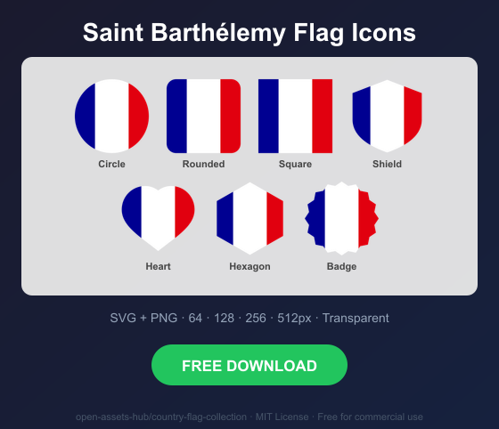
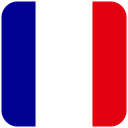

# Saint Barthélemy Flag Icons — Free SVG & PNG in 7 Shapes

Free Saint Barthélemy flag icons in 7 shapes. Transparent PNG (64, 128, 256, 512px) + SVG. Free for commercial use.

## Preview

      

## Download All Shapes

**[Download bl-flag-icons.zip](https://raw.githubusercontent.com/open-assets-hub/country-flag-collection/main/countries/bl/bl-flag-icons.zip)** — All 7 shapes, all sizes + SVG in one zip

## Download Individual

| Shape | SVG | 64px | 128px | 256px | 512px |
|---|---|---|---|---|---|
| Circle | [SVG](https://raw.githubusercontent.com/open-assets-hub/country-flag-collection/main/circle/svg/bl.svg) | [64](https://raw.githubusercontent.com/open-assets-hub/country-flag-collection/main/circle/64/bl.png) | [128](https://raw.githubusercontent.com/open-assets-hub/country-flag-collection/main/circle/128/bl.png) | [256](https://raw.githubusercontent.com/open-assets-hub/country-flag-collection/main/circle/256/bl.png) | [512](https://raw.githubusercontent.com/open-assets-hub/country-flag-collection/main/circle/512/bl.png) |
| Rounded | [SVG](https://raw.githubusercontent.com/open-assets-hub/country-flag-collection/main/rounded/svg/bl.svg) | [64](https://raw.githubusercontent.com/open-assets-hub/country-flag-collection/main/rounded/64/bl.png) | [128](https://raw.githubusercontent.com/open-assets-hub/country-flag-collection/main/rounded/128/bl.png) | [256](https://raw.githubusercontent.com/open-assets-hub/country-flag-collection/main/rounded/256/bl.png) | [512](https://raw.githubusercontent.com/open-assets-hub/country-flag-collection/main/rounded/512/bl.png) |
| Square | [SVG](https://raw.githubusercontent.com/open-assets-hub/country-flag-collection/main/square/svg/bl.svg) | [64](https://raw.githubusercontent.com/open-assets-hub/country-flag-collection/main/square/64/bl.png) | [128](https://raw.githubusercontent.com/open-assets-hub/country-flag-collection/main/square/128/bl.png) | [256](https://raw.githubusercontent.com/open-assets-hub/country-flag-collection/main/square/256/bl.png) | [512](https://raw.githubusercontent.com/open-assets-hub/country-flag-collection/main/square/512/bl.png) |
| Shield | [SVG](https://raw.githubusercontent.com/open-assets-hub/country-flag-collection/main/shield/svg/bl.svg) | [64](https://raw.githubusercontent.com/open-assets-hub/country-flag-collection/main/shield/64/bl.png) | [128](https://raw.githubusercontent.com/open-assets-hub/country-flag-collection/main/shield/128/bl.png) | [256](https://raw.githubusercontent.com/open-assets-hub/country-flag-collection/main/shield/256/bl.png) | [512](https://raw.githubusercontent.com/open-assets-hub/country-flag-collection/main/shield/512/bl.png) |
| Heart | [SVG](https://raw.githubusercontent.com/open-assets-hub/country-flag-collection/main/heart/svg/bl.svg) | [64](https://raw.githubusercontent.com/open-assets-hub/country-flag-collection/main/heart/64/bl.png) | [128](https://raw.githubusercontent.com/open-assets-hub/country-flag-collection/main/heart/128/bl.png) | [256](https://raw.githubusercontent.com/open-assets-hub/country-flag-collection/main/heart/256/bl.png) | [512](https://raw.githubusercontent.com/open-assets-hub/country-flag-collection/main/heart/512/bl.png) |
| Hexagon | [SVG](https://raw.githubusercontent.com/open-assets-hub/country-flag-collection/main/hexagon/svg/bl.svg) | [64](https://raw.githubusercontent.com/open-assets-hub/country-flag-collection/main/hexagon/64/bl.png) | [128](https://raw.githubusercontent.com/open-assets-hub/country-flag-collection/main/hexagon/128/bl.png) | [256](https://raw.githubusercontent.com/open-assets-hub/country-flag-collection/main/hexagon/256/bl.png) | [512](https://raw.githubusercontent.com/open-assets-hub/country-flag-collection/main/hexagon/512/bl.png) |
| Badge | [SVG](https://raw.githubusercontent.com/open-assets-hub/country-flag-collection/main/badge/svg/bl.svg) | [64](https://raw.githubusercontent.com/open-assets-hub/country-flag-collection/main/badge/64/bl.png) | [128](https://raw.githubusercontent.com/open-assets-hub/country-flag-collection/main/badge/128/bl.png) | [256](https://raw.githubusercontent.com/open-assets-hub/country-flag-collection/main/badge/256/bl.png) | [512](https://raw.githubusercontent.com/open-assets-hub/country-flag-collection/main/badge/512/bl.png) |

## Keywords

Saint Barthélemy flag icon, Saint Barthélemy flag png, Saint Barthélemy flag svg, Saint Barthélemy flag circle,
Saint Barthélemy flag rounded, Saint Barthélemy flag shield, Saint Barthélemy flag heart,
BL flag icon, free Saint Barthélemy flag download, Saint Barthélemy flag transparent png

[← All countries](../../README.md)
