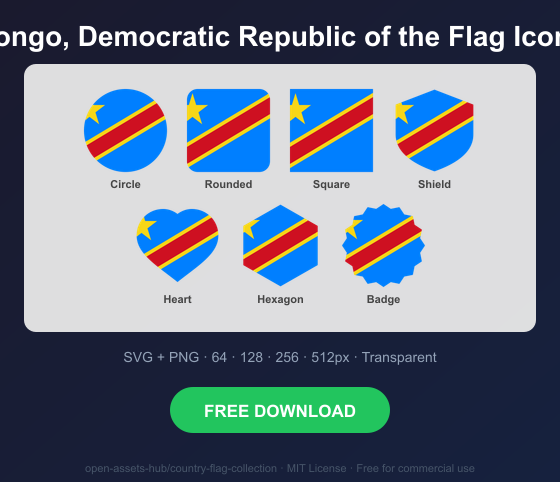
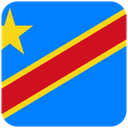
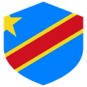
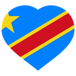
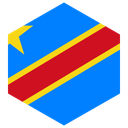
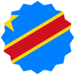

# Congo, Democratic Republic of the Flag Icons — Free SVG & PNG in 7 Shapes

Free Congo, Democratic Republic of the flag icons in 7 shapes. Transparent PNG (64, 128, 256, 512px) + SVG. Free for commercial use.

## Preview

      

## Download All Shapes

**[Download cd-flag-icons.zip](https://raw.githubusercontent.com/open-assets-hub/country-flag-collection/main/countries/cd/cd-flag-icons.zip)** — All 7 shapes, all sizes + SVG in one zip

## Download Individual

| Shape | SVG | 64px | 128px | 256px | 512px |
|---|---|---|---|---|---|
| Circle | [SVG](https://raw.githubusercontent.com/open-assets-hub/country-flag-collection/main/circle/svg/cd.svg) | [64](https://raw.githubusercontent.com/open-assets-hub/country-flag-collection/main/circle/64/cd.png) | [128](https://raw.githubusercontent.com/open-assets-hub/country-flag-collection/main/circle/128/cd.png) | [256](https://raw.githubusercontent.com/open-assets-hub/country-flag-collection/main/circle/256/cd.png) | [512](https://raw.githubusercontent.com/open-assets-hub/country-flag-collection/main/circle/512/cd.png) |
| Rounded | [SVG](https://raw.githubusercontent.com/open-assets-hub/country-flag-collection/main/rounded/svg/cd.svg) | [64](https://raw.githubusercontent.com/open-assets-hub/country-flag-collection/main/rounded/64/cd.png) | [128](https://raw.githubusercontent.com/open-assets-hub/country-flag-collection/main/rounded/128/cd.png) | [256](https://raw.githubusercontent.com/open-assets-hub/country-flag-collection/main/rounded/256/cd.png) | [512](https://raw.githubusercontent.com/open-assets-hub/country-flag-collection/main/rounded/512/cd.png) |
| Square | [SVG](https://raw.githubusercontent.com/open-assets-hub/country-flag-collection/main/square/svg/cd.svg) | [64](https://raw.githubusercontent.com/open-assets-hub/country-flag-collection/main/square/64/cd.png) | [128](https://raw.githubusercontent.com/open-assets-hub/country-flag-collection/main/square/128/cd.png) | [256](https://raw.githubusercontent.com/open-assets-hub/country-flag-collection/main/square/256/cd.png) | [512](https://raw.githubusercontent.com/open-assets-hub/country-flag-collection/main/square/512/cd.png) |
| Shield | [SVG](https://raw.githubusercontent.com/open-assets-hub/country-flag-collection/main/shield/svg/cd.svg) | [64](https://raw.githubusercontent.com/open-assets-hub/country-flag-collection/main/shield/64/cd.png) | [128](https://raw.githubusercontent.com/open-assets-hub/country-flag-collection/main/shield/128/cd.png) | [256](https://raw.githubusercontent.com/open-assets-hub/country-flag-collection/main/shield/256/cd.png) | [512](https://raw.githubusercontent.com/open-assets-hub/country-flag-collection/main/shield/512/cd.png) |
| Heart | [SVG](https://raw.githubusercontent.com/open-assets-hub/country-flag-collection/main/heart/svg/cd.svg) | [64](https://raw.githubusercontent.com/open-assets-hub/country-flag-collection/main/heart/64/cd.png) | [128](https://raw.githubusercontent.com/open-assets-hub/country-flag-collection/main/heart/128/cd.png) | [256](https://raw.githubusercontent.com/open-assets-hub/country-flag-collection/main/heart/256/cd.png) | [512](https://raw.githubusercontent.com/open-assets-hub/country-flag-collection/main/heart/512/cd.png) |
| Hexagon | [SVG](https://raw.githubusercontent.com/open-assets-hub/country-flag-collection/main/hexagon/svg/cd.svg) | [64](https://raw.githubusercontent.com/open-assets-hub/country-flag-collection/main/hexagon/64/cd.png) | [128](https://raw.githubusercontent.com/open-assets-hub/country-flag-collection/main/hexagon/128/cd.png) | [256](https://raw.githubusercontent.com/open-assets-hub/country-flag-collection/main/hexagon/256/cd.png) | [512](https://raw.githubusercontent.com/open-assets-hub/country-flag-collection/main/hexagon/512/cd.png) |
| Badge | [SVG](https://raw.githubusercontent.com/open-assets-hub/country-flag-collection/main/badge/svg/cd.svg) | [64](https://raw.githubusercontent.com/open-assets-hub/country-flag-collection/main/badge/64/cd.png) | [128](https://raw.githubusercontent.com/open-assets-hub/country-flag-collection/main/badge/128/cd.png) | [256](https://raw.githubusercontent.com/open-assets-hub/country-flag-collection/main/badge/256/cd.png) | [512](https://raw.githubusercontent.com/open-assets-hub/country-flag-collection/main/badge/512/cd.png) |

## Keywords

Congo, Democratic Republic of the flag icon, Congo, Democratic Republic of the flag png, Congo, Democratic Republic of the flag svg, Congo, Democratic Republic of the flag circle,
Congo, Democratic Republic of the flag rounded, Congo, Democratic Republic of the flag shield, Congo, Democratic Republic of the flag heart,
CD flag icon, free Congo, Democratic Republic of the flag download, Congo, Democratic Republic of the flag transparent png

[← All countries](../../README.md)
