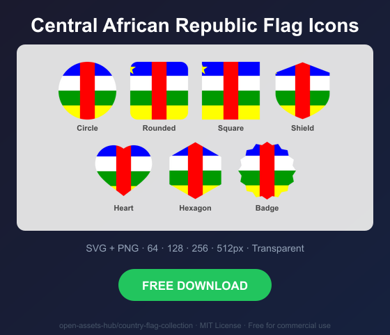
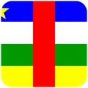
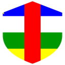
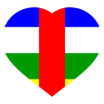
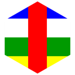
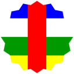

# Central African Republic Flag Icons — Free SVG & PNG in 7 Shapes

Free Central African Republic flag icons in 7 shapes. Transparent PNG (64, 128, 256, 512px) + SVG. Free for commercial use.

## Preview

      

## Download All Shapes

**[Download cf-flag-icons.zip](cf-flag-icons.zip)** — All 7 shapes, all sizes + SVG in one zip

## Download Individual

| Shape | SVG | 64px | 128px | 256px | 512px |
|---|---|---|---|---|---|
| Circle | [SVG](https://raw.githubusercontent.com/open-assets-hub/country-flag-collection/main/circle/svg/cf.svg) | [64](https://raw.githubusercontent.com/open-assets-hub/country-flag-collection/main/circle/64/cf.png) | [128](https://raw.githubusercontent.com/open-assets-hub/country-flag-collection/main/circle/128/cf.png) | [256](https://raw.githubusercontent.com/open-assets-hub/country-flag-collection/main/circle/256/cf.png) | [512](https://raw.githubusercontent.com/open-assets-hub/country-flag-collection/main/circle/512/cf.png) |
| Rounded | [SVG](https://raw.githubusercontent.com/open-assets-hub/country-flag-collection/main/rounded/svg/cf.svg) | [64](https://raw.githubusercontent.com/open-assets-hub/country-flag-collection/main/rounded/64/cf.png) | [128](https://raw.githubusercontent.com/open-assets-hub/country-flag-collection/main/rounded/128/cf.png) | [256](https://raw.githubusercontent.com/open-assets-hub/country-flag-collection/main/rounded/256/cf.png) | [512](https://raw.githubusercontent.com/open-assets-hub/country-flag-collection/main/rounded/512/cf.png) |
| Square | [SVG](https://raw.githubusercontent.com/open-assets-hub/country-flag-collection/main/square/svg/cf.svg) | [64](https://raw.githubusercontent.com/open-assets-hub/country-flag-collection/main/square/64/cf.png) | [128](https://raw.githubusercontent.com/open-assets-hub/country-flag-collection/main/square/128/cf.png) | [256](https://raw.githubusercontent.com/open-assets-hub/country-flag-collection/main/square/256/cf.png) | [512](https://raw.githubusercontent.com/open-assets-hub/country-flag-collection/main/square/512/cf.png) |
| Shield | [SVG](https://raw.githubusercontent.com/open-assets-hub/country-flag-collection/main/shield/svg/cf.svg) | [64](https://raw.githubusercontent.com/open-assets-hub/country-flag-collection/main/shield/64/cf.png) | [128](https://raw.githubusercontent.com/open-assets-hub/country-flag-collection/main/shield/128/cf.png) | [256](https://raw.githubusercontent.com/open-assets-hub/country-flag-collection/main/shield/256/cf.png) | [512](https://raw.githubusercontent.com/open-assets-hub/country-flag-collection/main/shield/512/cf.png) |
| Heart | [SVG](https://raw.githubusercontent.com/open-assets-hub/country-flag-collection/main/heart/svg/cf.svg) | [64](https://raw.githubusercontent.com/open-assets-hub/country-flag-collection/main/heart/64/cf.png) | [128](https://raw.githubusercontent.com/open-assets-hub/country-flag-collection/main/heart/128/cf.png) | [256](https://raw.githubusercontent.com/open-assets-hub/country-flag-collection/main/heart/256/cf.png) | [512](https://raw.githubusercontent.com/open-assets-hub/country-flag-collection/main/heart/512/cf.png) |
| Hexagon | [SVG](https://raw.githubusercontent.com/open-assets-hub/country-flag-collection/main/hexagon/svg/cf.svg) | [64](https://raw.githubusercontent.com/open-assets-hub/country-flag-collection/main/hexagon/64/cf.png) | [128](https://raw.githubusercontent.com/open-assets-hub/country-flag-collection/main/hexagon/128/cf.png) | [256](https://raw.githubusercontent.com/open-assets-hub/country-flag-collection/main/hexagon/256/cf.png) | [512](https://raw.githubusercontent.com/open-assets-hub/country-flag-collection/main/hexagon/512/cf.png) |
| Badge | [SVG](https://raw.githubusercontent.com/open-assets-hub/country-flag-collection/main/badge/svg/cf.svg) | [64](https://raw.githubusercontent.com/open-assets-hub/country-flag-collection/main/badge/64/cf.png) | [128](https://raw.githubusercontent.com/open-assets-hub/country-flag-collection/main/badge/128/cf.png) | [256](https://raw.githubusercontent.com/open-assets-hub/country-flag-collection/main/badge/256/cf.png) | [512](https://raw.githubusercontent.com/open-assets-hub/country-flag-collection/main/badge/512/cf.png) |

## Keywords

Central African Republic flag icon, Central African Republic flag png, Central African Republic flag svg, Central African Republic flag circle,
Central African Republic flag rounded, Central African Republic flag shield, Central African Republic flag heart,
CF flag icon, free Central African Republic flag download, Central African Republic flag transparent png

[← All countries](../../README.md)
