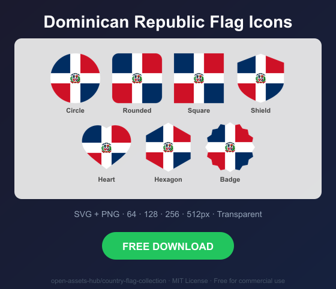
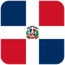
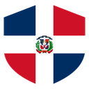
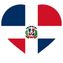
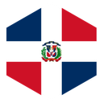
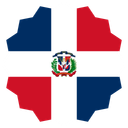

# Dominican Republic Flag Icons — Free SVG & PNG in 7 Shapes

Free Dominican Republic flag icons in 7 shapes. Transparent PNG (64, 128, 256, 512px) + SVG. Free for commercial use.

## Preview

      

## Download All Shapes

**[Download do-flag-icons.zip](do-flag-icons.zip)** — All 7 shapes, all sizes + SVG in one zip

## Download Individual

| Shape | SVG | 64px | 128px | 256px | 512px |
|---|---|---|---|---|---|
| Circle | [SVG](https://raw.githubusercontent.com/open-assets-hub/country-flag-collection/main/circle/svg/do.svg) | [64](https://raw.githubusercontent.com/open-assets-hub/country-flag-collection/main/circle/64/do.png) | [128](https://raw.githubusercontent.com/open-assets-hub/country-flag-collection/main/circle/128/do.png) | [256](https://raw.githubusercontent.com/open-assets-hub/country-flag-collection/main/circle/256/do.png) | [512](https://raw.githubusercontent.com/open-assets-hub/country-flag-collection/main/circle/512/do.png) |
| Rounded | [SVG](https://raw.githubusercontent.com/open-assets-hub/country-flag-collection/main/rounded/svg/do.svg) | [64](https://raw.githubusercontent.com/open-assets-hub/country-flag-collection/main/rounded/64/do.png) | [128](https://raw.githubusercontent.com/open-assets-hub/country-flag-collection/main/rounded/128/do.png) | [256](https://raw.githubusercontent.com/open-assets-hub/country-flag-collection/main/rounded/256/do.png) | [512](https://raw.githubusercontent.com/open-assets-hub/country-flag-collection/main/rounded/512/do.png) |
| Square | [SVG](https://raw.githubusercontent.com/open-assets-hub/country-flag-collection/main/square/svg/do.svg) | [64](https://raw.githubusercontent.com/open-assets-hub/country-flag-collection/main/square/64/do.png) | [128](https://raw.githubusercontent.com/open-assets-hub/country-flag-collection/main/square/128/do.png) | [256](https://raw.githubusercontent.com/open-assets-hub/country-flag-collection/main/square/256/do.png) | [512](https://raw.githubusercontent.com/open-assets-hub/country-flag-collection/main/square/512/do.png) |
| Shield | [SVG](https://raw.githubusercontent.com/open-assets-hub/country-flag-collection/main/shield/svg/do.svg) | [64](https://raw.githubusercontent.com/open-assets-hub/country-flag-collection/main/shield/64/do.png) | [128](https://raw.githubusercontent.com/open-assets-hub/country-flag-collection/main/shield/128/do.png) | [256](https://raw.githubusercontent.com/open-assets-hub/country-flag-collection/main/shield/256/do.png) | [512](https://raw.githubusercontent.com/open-assets-hub/country-flag-collection/main/shield/512/do.png) |
| Heart | [SVG](https://raw.githubusercontent.com/open-assets-hub/country-flag-collection/main/heart/svg/do.svg) | [64](https://raw.githubusercontent.com/open-assets-hub/country-flag-collection/main/heart/64/do.png) | [128](https://raw.githubusercontent.com/open-assets-hub/country-flag-collection/main/heart/128/do.png) | [256](https://raw.githubusercontent.com/open-assets-hub/country-flag-collection/main/heart/256/do.png) | [512](https://raw.githubusercontent.com/open-assets-hub/country-flag-collection/main/heart/512/do.png) |
| Hexagon | [SVG](https://raw.githubusercontent.com/open-assets-hub/country-flag-collection/main/hexagon/svg/do.svg) | [64](https://raw.githubusercontent.com/open-assets-hub/country-flag-collection/main/hexagon/64/do.png) | [128](https://raw.githubusercontent.com/open-assets-hub/country-flag-collection/main/hexagon/128/do.png) | [256](https://raw.githubusercontent.com/open-assets-hub/country-flag-collection/main/hexagon/256/do.png) | [512](https://raw.githubusercontent.com/open-assets-hub/country-flag-collection/main/hexagon/512/do.png) |
| Badge | [SVG](https://raw.githubusercontent.com/open-assets-hub/country-flag-collection/main/badge/svg/do.svg) | [64](https://raw.githubusercontent.com/open-assets-hub/country-flag-collection/main/badge/64/do.png) | [128](https://raw.githubusercontent.com/open-assets-hub/country-flag-collection/main/badge/128/do.png) | [256](https://raw.githubusercontent.com/open-assets-hub/country-flag-collection/main/badge/256/do.png) | [512](https://raw.githubusercontent.com/open-assets-hub/country-flag-collection/main/badge/512/do.png) |

## Keywords

Dominican Republic flag icon, Dominican Republic flag png, Dominican Republic flag svg, Dominican Republic flag circle,
Dominican Republic flag rounded, Dominican Republic flag shield, Dominican Republic flag heart,
DO flag icon, free Dominican Republic flag download, Dominican Republic flag transparent png

[← All countries](../../README.md)
