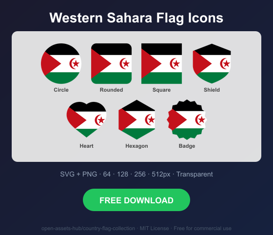
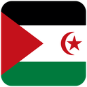
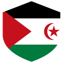
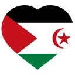
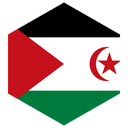
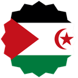

# Western Sahara Flag Icons — Free SVG & PNG in 7 Shapes

Free Western Sahara flag icons in 7 shapes. Transparent PNG (64, 128, 256, 512px) + SVG. Free for commercial use.

## Preview

      

## Download All Shapes

**[Download eh-flag-icons.zip](eh-flag-icons.zip)** — All 7 shapes, all sizes + SVG in one zip

## Download Individual

| Shape | SVG | 64px | 128px | 256px | 512px |
|---|---|---|---|---|---|
| Circle | [SVG](https://raw.githubusercontent.com/open-assets-hub/country-flag-collection/main/circle/svg/eh.svg) | [64](https://raw.githubusercontent.com/open-assets-hub/country-flag-collection/main/circle/64/eh.png) | [128](https://raw.githubusercontent.com/open-assets-hub/country-flag-collection/main/circle/128/eh.png) | [256](https://raw.githubusercontent.com/open-assets-hub/country-flag-collection/main/circle/256/eh.png) | [512](https://raw.githubusercontent.com/open-assets-hub/country-flag-collection/main/circle/512/eh.png) |
| Rounded | [SVG](https://raw.githubusercontent.com/open-assets-hub/country-flag-collection/main/rounded/svg/eh.svg) | [64](https://raw.githubusercontent.com/open-assets-hub/country-flag-collection/main/rounded/64/eh.png) | [128](https://raw.githubusercontent.com/open-assets-hub/country-flag-collection/main/rounded/128/eh.png) | [256](https://raw.githubusercontent.com/open-assets-hub/country-flag-collection/main/rounded/256/eh.png) | [512](https://raw.githubusercontent.com/open-assets-hub/country-flag-collection/main/rounded/512/eh.png) |
| Square | [SVG](https://raw.githubusercontent.com/open-assets-hub/country-flag-collection/main/square/svg/eh.svg) | [64](https://raw.githubusercontent.com/open-assets-hub/country-flag-collection/main/square/64/eh.png) | [128](https://raw.githubusercontent.com/open-assets-hub/country-flag-collection/main/square/128/eh.png) | [256](https://raw.githubusercontent.com/open-assets-hub/country-flag-collection/main/square/256/eh.png) | [512](https://raw.githubusercontent.com/open-assets-hub/country-flag-collection/main/square/512/eh.png) |
| Shield | [SVG](https://raw.githubusercontent.com/open-assets-hub/country-flag-collection/main/shield/svg/eh.svg) | [64](https://raw.githubusercontent.com/open-assets-hub/country-flag-collection/main/shield/64/eh.png) | [128](https://raw.githubusercontent.com/open-assets-hub/country-flag-collection/main/shield/128/eh.png) | [256](https://raw.githubusercontent.com/open-assets-hub/country-flag-collection/main/shield/256/eh.png) | [512](https://raw.githubusercontent.com/open-assets-hub/country-flag-collection/main/shield/512/eh.png) |
| Heart | [SVG](https://raw.githubusercontent.com/open-assets-hub/country-flag-collection/main/heart/svg/eh.svg) | [64](https://raw.githubusercontent.com/open-assets-hub/country-flag-collection/main/heart/64/eh.png) | [128](https://raw.githubusercontent.com/open-assets-hub/country-flag-collection/main/heart/128/eh.png) | [256](https://raw.githubusercontent.com/open-assets-hub/country-flag-collection/main/heart/256/eh.png) | [512](https://raw.githubusercontent.com/open-assets-hub/country-flag-collection/main/heart/512/eh.png) |
| Hexagon | [SVG](https://raw.githubusercontent.com/open-assets-hub/country-flag-collection/main/hexagon/svg/eh.svg) | [64](https://raw.githubusercontent.com/open-assets-hub/country-flag-collection/main/hexagon/64/eh.png) | [128](https://raw.githubusercontent.com/open-assets-hub/country-flag-collection/main/hexagon/128/eh.png) | [256](https://raw.githubusercontent.com/open-assets-hub/country-flag-collection/main/hexagon/256/eh.png) | [512](https://raw.githubusercontent.com/open-assets-hub/country-flag-collection/main/hexagon/512/eh.png) |
| Badge | [SVG](https://raw.githubusercontent.com/open-assets-hub/country-flag-collection/main/badge/svg/eh.svg) | [64](https://raw.githubusercontent.com/open-assets-hub/country-flag-collection/main/badge/64/eh.png) | [128](https://raw.githubusercontent.com/open-assets-hub/country-flag-collection/main/badge/128/eh.png) | [256](https://raw.githubusercontent.com/open-assets-hub/country-flag-collection/main/badge/256/eh.png) | [512](https://raw.githubusercontent.com/open-assets-hub/country-flag-collection/main/badge/512/eh.png) |

## Keywords

Western Sahara flag icon, Western Sahara flag png, Western Sahara flag svg, Western Sahara flag circle,
Western Sahara flag rounded, Western Sahara flag shield, Western Sahara flag heart,
EH flag icon, free Western Sahara flag download, Western Sahara flag transparent png

[← All countries](../../README.md)
