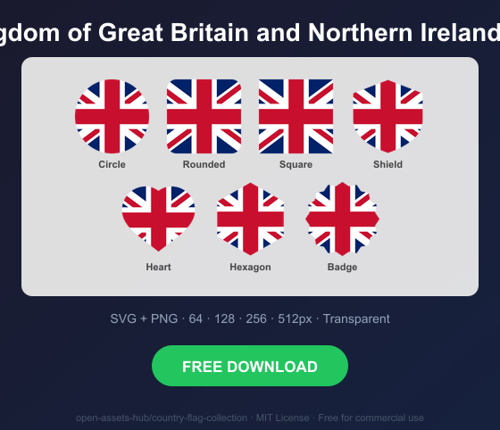
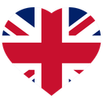

# United Kingdom of Great Britain and Northern Ireland Flag Icons — Free SVG & PNG in 7 Shapes

Free United Kingdom of Great Britain and Northern Ireland flag icons in 7 shapes. Transparent PNG (64, 128, 256, 512px) + SVG. Free for commercial use.

## Preview

      

## Download All Shapes

**[Download gb-flag-icons.zip](gb-flag-icons.zip)** — All 7 shapes, all sizes + SVG in one zip

## Download Individual

| Shape | SVG | 64px | 128px | 256px | 512px |
|---|---|---|---|---|---|
| Circle | [SVG](https://raw.githubusercontent.com/open-assets-hub/country-flag-collection/main/circle/svg/gb.svg) | [64](https://raw.githubusercontent.com/open-assets-hub/country-flag-collection/main/circle/64/gb.png) | [128](https://raw.githubusercontent.com/open-assets-hub/country-flag-collection/main/circle/128/gb.png) | [256](https://raw.githubusercontent.com/open-assets-hub/country-flag-collection/main/circle/256/gb.png) | [512](https://raw.githubusercontent.com/open-assets-hub/country-flag-collection/main/circle/512/gb.png) |
| Rounded | [SVG](https://raw.githubusercontent.com/open-assets-hub/country-flag-collection/main/rounded/svg/gb.svg) | [64](https://raw.githubusercontent.com/open-assets-hub/country-flag-collection/main/rounded/64/gb.png) | [128](https://raw.githubusercontent.com/open-assets-hub/country-flag-collection/main/rounded/128/gb.png) | [256](https://raw.githubusercontent.com/open-assets-hub/country-flag-collection/main/rounded/256/gb.png) | [512](https://raw.githubusercontent.com/open-assets-hub/country-flag-collection/main/rounded/512/gb.png) |
| Square | [SVG](https://raw.githubusercontent.com/open-assets-hub/country-flag-collection/main/square/svg/gb.svg) | [64](https://raw.githubusercontent.com/open-assets-hub/country-flag-collection/main/square/64/gb.png) | [128](https://raw.githubusercontent.com/open-assets-hub/country-flag-collection/main/square/128/gb.png) | [256](https://raw.githubusercontent.com/open-assets-hub/country-flag-collection/main/square/256/gb.png) | [512](https://raw.githubusercontent.com/open-assets-hub/country-flag-collection/main/square/512/gb.png) |
| Shield | [SVG](https://raw.githubusercontent.com/open-assets-hub/country-flag-collection/main/shield/svg/gb.svg) | [64](https://raw.githubusercontent.com/open-assets-hub/country-flag-collection/main/shield/64/gb.png) | [128](https://raw.githubusercontent.com/open-assets-hub/country-flag-collection/main/shield/128/gb.png) | [256](https://raw.githubusercontent.com/open-assets-hub/country-flag-collection/main/shield/256/gb.png) | [512](https://raw.githubusercontent.com/open-assets-hub/country-flag-collection/main/shield/512/gb.png) |
| Heart | [SVG](https://raw.githubusercontent.com/open-assets-hub/country-flag-collection/main/heart/svg/gb.svg) | [64](https://raw.githubusercontent.com/open-assets-hub/country-flag-collection/main/heart/64/gb.png) | [128](https://raw.githubusercontent.com/open-assets-hub/country-flag-collection/main/heart/128/gb.png) | [256](https://raw.githubusercontent.com/open-assets-hub/country-flag-collection/main/heart/256/gb.png) | [512](https://raw.githubusercontent.com/open-assets-hub/country-flag-collection/main/heart/512/gb.png) |
| Hexagon | [SVG](https://raw.githubusercontent.com/open-assets-hub/country-flag-collection/main/hexagon/svg/gb.svg) | [64](https://raw.githubusercontent.com/open-assets-hub/country-flag-collection/main/hexagon/64/gb.png) | [128](https://raw.githubusercontent.com/open-assets-hub/country-flag-collection/main/hexagon/128/gb.png) | [256](https://raw.githubusercontent.com/open-assets-hub/country-flag-collection/main/hexagon/256/gb.png) | [512](https://raw.githubusercontent.com/open-assets-hub/country-flag-collection/main/hexagon/512/gb.png) |
| Badge | [SVG](https://raw.githubusercontent.com/open-assets-hub/country-flag-collection/main/badge/svg/gb.svg) | [64](https://raw.githubusercontent.com/open-assets-hub/country-flag-collection/main/badge/64/gb.png) | [128](https://raw.githubusercontent.com/open-assets-hub/country-flag-collection/main/badge/128/gb.png) | [256](https://raw.githubusercontent.com/open-assets-hub/country-flag-collection/main/badge/256/gb.png) | [512](https://raw.githubusercontent.com/open-assets-hub/country-flag-collection/main/badge/512/gb.png) |

## Keywords

United Kingdom of Great Britain and Northern Ireland flag icon, United Kingdom of Great Britain and Northern Ireland flag png, United Kingdom of Great Britain and Northern Ireland flag svg, United Kingdom of Great Britain and Northern Ireland flag circle,
United Kingdom of Great Britain and Northern Ireland flag rounded, United Kingdom of Great Britain and Northern Ireland flag shield, United Kingdom of Great Britain and Northern Ireland flag heart,
GB flag icon, free United Kingdom of Great Britain and Northern Ireland flag download, United Kingdom of Great Britain and Northern Ireland flag transparent png

[← All countries](../../README.md)
