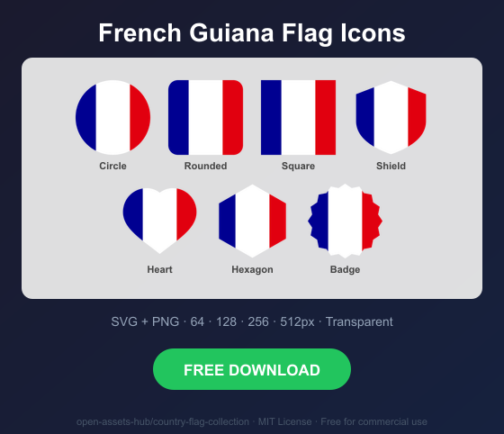
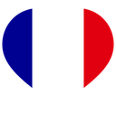

# French Guiana Flag Icons — Free SVG & PNG in 7 Shapes

Free French Guiana flag icons in 7 shapes. Transparent PNG (64, 128, 256, 512px) + SVG. Free for commercial use.

## Preview

      

## Download All Shapes

**[Download gf-flag-icons.zip](https://raw.githubusercontent.com/open-assets-hub/country-flag-collection/main/countries/gf/gf-flag-icons.zip)** — All 7 shapes, all sizes + SVG in one zip

## Download Individual

| Shape | SVG | 64px | 128px | 256px | 512px |
|---|---|---|---|---|---|
| Circle | [SVG](https://raw.githubusercontent.com/open-assets-hub/country-flag-collection/main/circle/svg/gf.svg) | [64](https://raw.githubusercontent.com/open-assets-hub/country-flag-collection/main/circle/64/gf.png) | [128](https://raw.githubusercontent.com/open-assets-hub/country-flag-collection/main/circle/128/gf.png) | [256](https://raw.githubusercontent.com/open-assets-hub/country-flag-collection/main/circle/256/gf.png) | [512](https://raw.githubusercontent.com/open-assets-hub/country-flag-collection/main/circle/512/gf.png) |
| Rounded | [SVG](https://raw.githubusercontent.com/open-assets-hub/country-flag-collection/main/rounded/svg/gf.svg) | [64](https://raw.githubusercontent.com/open-assets-hub/country-flag-collection/main/rounded/64/gf.png) | [128](https://raw.githubusercontent.com/open-assets-hub/country-flag-collection/main/rounded/128/gf.png) | [256](https://raw.githubusercontent.com/open-assets-hub/country-flag-collection/main/rounded/256/gf.png) | [512](https://raw.githubusercontent.com/open-assets-hub/country-flag-collection/main/rounded/512/gf.png) |
| Square | [SVG](https://raw.githubusercontent.com/open-assets-hub/country-flag-collection/main/square/svg/gf.svg) | [64](https://raw.githubusercontent.com/open-assets-hub/country-flag-collection/main/square/64/gf.png) | [128](https://raw.githubusercontent.com/open-assets-hub/country-flag-collection/main/square/128/gf.png) | [256](https://raw.githubusercontent.com/open-assets-hub/country-flag-collection/main/square/256/gf.png) | [512](https://raw.githubusercontent.com/open-assets-hub/country-flag-collection/main/square/512/gf.png) |
| Shield | [SVG](https://raw.githubusercontent.com/open-assets-hub/country-flag-collection/main/shield/svg/gf.svg) | [64](https://raw.githubusercontent.com/open-assets-hub/country-flag-collection/main/shield/64/gf.png) | [128](https://raw.githubusercontent.com/open-assets-hub/country-flag-collection/main/shield/128/gf.png) | [256](https://raw.githubusercontent.com/open-assets-hub/country-flag-collection/main/shield/256/gf.png) | [512](https://raw.githubusercontent.com/open-assets-hub/country-flag-collection/main/shield/512/gf.png) |
| Heart | [SVG](https://raw.githubusercontent.com/open-assets-hub/country-flag-collection/main/heart/svg/gf.svg) | [64](https://raw.githubusercontent.com/open-assets-hub/country-flag-collection/main/heart/64/gf.png) | [128](https://raw.githubusercontent.com/open-assets-hub/country-flag-collection/main/heart/128/gf.png) | [256](https://raw.githubusercontent.com/open-assets-hub/country-flag-collection/main/heart/256/gf.png) | [512](https://raw.githubusercontent.com/open-assets-hub/country-flag-collection/main/heart/512/gf.png) |
| Hexagon | [SVG](https://raw.githubusercontent.com/open-assets-hub/country-flag-collection/main/hexagon/svg/gf.svg) | [64](https://raw.githubusercontent.com/open-assets-hub/country-flag-collection/main/hexagon/64/gf.png) | [128](https://raw.githubusercontent.com/open-assets-hub/country-flag-collection/main/hexagon/128/gf.png) | [256](https://raw.githubusercontent.com/open-assets-hub/country-flag-collection/main/hexagon/256/gf.png) | [512](https://raw.githubusercontent.com/open-assets-hub/country-flag-collection/main/hexagon/512/gf.png) |
| Badge | [SVG](https://raw.githubusercontent.com/open-assets-hub/country-flag-collection/main/badge/svg/gf.svg) | [64](https://raw.githubusercontent.com/open-assets-hub/country-flag-collection/main/badge/64/gf.png) | [128](https://raw.githubusercontent.com/open-assets-hub/country-flag-collection/main/badge/128/gf.png) | [256](https://raw.githubusercontent.com/open-assets-hub/country-flag-collection/main/badge/256/gf.png) | [512](https://raw.githubusercontent.com/open-assets-hub/country-flag-collection/main/badge/512/gf.png) |

## Keywords

French Guiana flag icon, French Guiana flag png, French Guiana flag svg, French Guiana flag circle,
French Guiana flag rounded, French Guiana flag shield, French Guiana flag heart,
GF flag icon, free French Guiana flag download, French Guiana flag transparent png

[← All countries](../../README.md)
