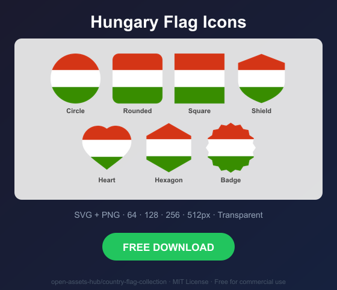
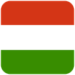
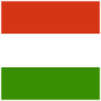
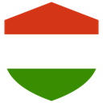
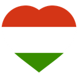
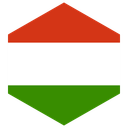
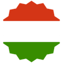

# Hungary Flag Icons — Free SVG & PNG in 7 Shapes

Free Hungary flag icons in 7 shapes. Transparent PNG (64, 128, 256, 512px) + SVG. Free for commercial use.

## Preview

      

## Download All Shapes

**[Download hu-flag-icons.zip](https://raw.githubusercontent.com/open-assets-hub/country-flag-collection/main/countries/hu/hu-flag-icons.zip)** — All 7 shapes, all sizes + SVG in one zip

## Download Individual

| Shape | SVG | 64px | 128px | 256px | 512px |
|---|---|---|---|---|---|
| Circle | [SVG](https://raw.githubusercontent.com/open-assets-hub/country-flag-collection/main/circle/svg/hu.svg) | [64](https://raw.githubusercontent.com/open-assets-hub/country-flag-collection/main/circle/64/hu.png) | [128](https://raw.githubusercontent.com/open-assets-hub/country-flag-collection/main/circle/128/hu.png) | [256](https://raw.githubusercontent.com/open-assets-hub/country-flag-collection/main/circle/256/hu.png) | [512](https://raw.githubusercontent.com/open-assets-hub/country-flag-collection/main/circle/512/hu.png) |
| Rounded | [SVG](https://raw.githubusercontent.com/open-assets-hub/country-flag-collection/main/rounded/svg/hu.svg) | [64](https://raw.githubusercontent.com/open-assets-hub/country-flag-collection/main/rounded/64/hu.png) | [128](https://raw.githubusercontent.com/open-assets-hub/country-flag-collection/main/rounded/128/hu.png) | [256](https://raw.githubusercontent.com/open-assets-hub/country-flag-collection/main/rounded/256/hu.png) | [512](https://raw.githubusercontent.com/open-assets-hub/country-flag-collection/main/rounded/512/hu.png) |
| Square | [SVG](https://raw.githubusercontent.com/open-assets-hub/country-flag-collection/main/square/svg/hu.svg) | [64](https://raw.githubusercontent.com/open-assets-hub/country-flag-collection/main/square/64/hu.png) | [128](https://raw.githubusercontent.com/open-assets-hub/country-flag-collection/main/square/128/hu.png) | [256](https://raw.githubusercontent.com/open-assets-hub/country-flag-collection/main/square/256/hu.png) | [512](https://raw.githubusercontent.com/open-assets-hub/country-flag-collection/main/square/512/hu.png) |
| Shield | [SVG](https://raw.githubusercontent.com/open-assets-hub/country-flag-collection/main/shield/svg/hu.svg) | [64](https://raw.githubusercontent.com/open-assets-hub/country-flag-collection/main/shield/64/hu.png) | [128](https://raw.githubusercontent.com/open-assets-hub/country-flag-collection/main/shield/128/hu.png) | [256](https://raw.githubusercontent.com/open-assets-hub/country-flag-collection/main/shield/256/hu.png) | [512](https://raw.githubusercontent.com/open-assets-hub/country-flag-collection/main/shield/512/hu.png) |
| Heart | [SVG](https://raw.githubusercontent.com/open-assets-hub/country-flag-collection/main/heart/svg/hu.svg) | [64](https://raw.githubusercontent.com/open-assets-hub/country-flag-collection/main/heart/64/hu.png) | [128](https://raw.githubusercontent.com/open-assets-hub/country-flag-collection/main/heart/128/hu.png) | [256](https://raw.githubusercontent.com/open-assets-hub/country-flag-collection/main/heart/256/hu.png) | [512](https://raw.githubusercontent.com/open-assets-hub/country-flag-collection/main/heart/512/hu.png) |
| Hexagon | [SVG](https://raw.githubusercontent.com/open-assets-hub/country-flag-collection/main/hexagon/svg/hu.svg) | [64](https://raw.githubusercontent.com/open-assets-hub/country-flag-collection/main/hexagon/64/hu.png) | [128](https://raw.githubusercontent.com/open-assets-hub/country-flag-collection/main/hexagon/128/hu.png) | [256](https://raw.githubusercontent.com/open-assets-hub/country-flag-collection/main/hexagon/256/hu.png) | [512](https://raw.githubusercontent.com/open-assets-hub/country-flag-collection/main/hexagon/512/hu.png) |
| Badge | [SVG](https://raw.githubusercontent.com/open-assets-hub/country-flag-collection/main/badge/svg/hu.svg) | [64](https://raw.githubusercontent.com/open-assets-hub/country-flag-collection/main/badge/64/hu.png) | [128](https://raw.githubusercontent.com/open-assets-hub/country-flag-collection/main/badge/128/hu.png) | [256](https://raw.githubusercontent.com/open-assets-hub/country-flag-collection/main/badge/256/hu.png) | [512](https://raw.githubusercontent.com/open-assets-hub/country-flag-collection/main/badge/512/hu.png) |

## Keywords

Hungary flag icon, Hungary flag png, Hungary flag svg, Hungary flag circle,
Hungary flag rounded, Hungary flag shield, Hungary flag heart,
HU flag icon, free Hungary flag download, Hungary flag transparent png

[← All countries](../../README.md)
