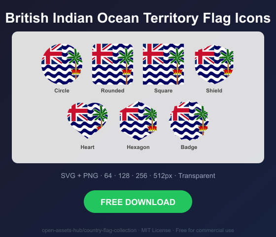
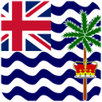
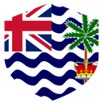
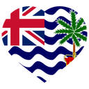
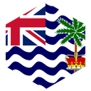

# British Indian Ocean Territory Flag Icons — Free SVG & PNG in 7 Shapes

Free British Indian Ocean Territory flag icons in 7 shapes. Transparent PNG (64, 128, 256, 512px) + SVG. Free for commercial use.

## Preview

      

## Download All Shapes

**[Download io-flag-icons.zip](https://raw.githubusercontent.com/open-assets-hub/country-flag-collection/main/countries/io/io-flag-icons.zip)** — All 7 shapes, all sizes + SVG in one zip

## Download Individual

| Shape | SVG | 64px | 128px | 256px | 512px |
|---|---|---|---|---|---|
| Circle | [SVG](https://raw.githubusercontent.com/open-assets-hub/country-flag-collection/main/circle/svg/io.svg) | [64](https://raw.githubusercontent.com/open-assets-hub/country-flag-collection/main/circle/64/io.png) | [128](https://raw.githubusercontent.com/open-assets-hub/country-flag-collection/main/circle/128/io.png) | [256](https://raw.githubusercontent.com/open-assets-hub/country-flag-collection/main/circle/256/io.png) | [512](https://raw.githubusercontent.com/open-assets-hub/country-flag-collection/main/circle/512/io.png) |
| Rounded | [SVG](https://raw.githubusercontent.com/open-assets-hub/country-flag-collection/main/rounded/svg/io.svg) | [64](https://raw.githubusercontent.com/open-assets-hub/country-flag-collection/main/rounded/64/io.png) | [128](https://raw.githubusercontent.com/open-assets-hub/country-flag-collection/main/rounded/128/io.png) | [256](https://raw.githubusercontent.com/open-assets-hub/country-flag-collection/main/rounded/256/io.png) | [512](https://raw.githubusercontent.com/open-assets-hub/country-flag-collection/main/rounded/512/io.png) |
| Square | [SVG](https://raw.githubusercontent.com/open-assets-hub/country-flag-collection/main/square/svg/io.svg) | [64](https://raw.githubusercontent.com/open-assets-hub/country-flag-collection/main/square/64/io.png) | [128](https://raw.githubusercontent.com/open-assets-hub/country-flag-collection/main/square/128/io.png) | [256](https://raw.githubusercontent.com/open-assets-hub/country-flag-collection/main/square/256/io.png) | [512](https://raw.githubusercontent.com/open-assets-hub/country-flag-collection/main/square/512/io.png) |
| Shield | [SVG](https://raw.githubusercontent.com/open-assets-hub/country-flag-collection/main/shield/svg/io.svg) | [64](https://raw.githubusercontent.com/open-assets-hub/country-flag-collection/main/shield/64/io.png) | [128](https://raw.githubusercontent.com/open-assets-hub/country-flag-collection/main/shield/128/io.png) | [256](https://raw.githubusercontent.com/open-assets-hub/country-flag-collection/main/shield/256/io.png) | [512](https://raw.githubusercontent.com/open-assets-hub/country-flag-collection/main/shield/512/io.png) |
| Heart | [SVG](https://raw.githubusercontent.com/open-assets-hub/country-flag-collection/main/heart/svg/io.svg) | [64](https://raw.githubusercontent.com/open-assets-hub/country-flag-collection/main/heart/64/io.png) | [128](https://raw.githubusercontent.com/open-assets-hub/country-flag-collection/main/heart/128/io.png) | [256](https://raw.githubusercontent.com/open-assets-hub/country-flag-collection/main/heart/256/io.png) | [512](https://raw.githubusercontent.com/open-assets-hub/country-flag-collection/main/heart/512/io.png) |
| Hexagon | [SVG](https://raw.githubusercontent.com/open-assets-hub/country-flag-collection/main/hexagon/svg/io.svg) | [64](https://raw.githubusercontent.com/open-assets-hub/country-flag-collection/main/hexagon/64/io.png) | [128](https://raw.githubusercontent.com/open-assets-hub/country-flag-collection/main/hexagon/128/io.png) | [256](https://raw.githubusercontent.com/open-assets-hub/country-flag-collection/main/hexagon/256/io.png) | [512](https://raw.githubusercontent.com/open-assets-hub/country-flag-collection/main/hexagon/512/io.png) |
| Badge | [SVG](https://raw.githubusercontent.com/open-assets-hub/country-flag-collection/main/badge/svg/io.svg) | [64](https://raw.githubusercontent.com/open-assets-hub/country-flag-collection/main/badge/64/io.png) | [128](https://raw.githubusercontent.com/open-assets-hub/country-flag-collection/main/badge/128/io.png) | [256](https://raw.githubusercontent.com/open-assets-hub/country-flag-collection/main/badge/256/io.png) | [512](https://raw.githubusercontent.com/open-assets-hub/country-flag-collection/main/badge/512/io.png) |

## Keywords

British Indian Ocean Territory flag icon, British Indian Ocean Territory flag png, British Indian Ocean Territory flag svg, British Indian Ocean Territory flag circle,
British Indian Ocean Territory flag rounded, British Indian Ocean Territory flag shield, British Indian Ocean Territory flag heart,
IO flag icon, free British Indian Ocean Territory flag download, British Indian Ocean Territory flag transparent png

[← All countries](../../README.md)
