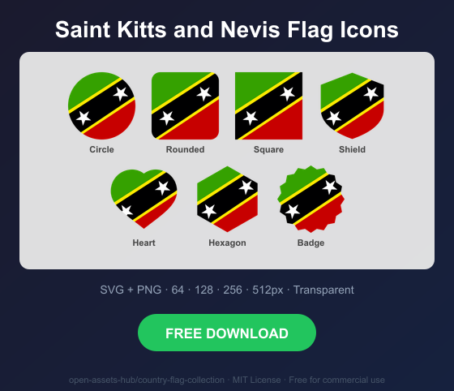
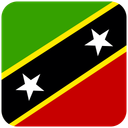
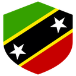
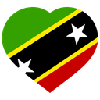
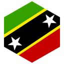
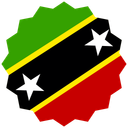

# Saint Kitts and Nevis Flag Icons — Free SVG & PNG in 7 Shapes

Free Saint Kitts and Nevis flag icons in 7 shapes. Transparent PNG (64, 128, 256, 512px) + SVG. Free for commercial use.

## Preview

      

## Download All Shapes

**[Download kn-flag-icons.zip](https://raw.githubusercontent.com/open-assets-hub/country-flag-collection/main/countries/kn/kn-flag-icons.zip)** — All 7 shapes, all sizes + SVG in one zip

## Download Individual

| Shape | SVG | 64px | 128px | 256px | 512px |
|---|---|---|---|---|---|
| Circle | [SVG](https://raw.githubusercontent.com/open-assets-hub/country-flag-collection/main/circle/svg/kn.svg) | [64](https://raw.githubusercontent.com/open-assets-hub/country-flag-collection/main/circle/64/kn.png) | [128](https://raw.githubusercontent.com/open-assets-hub/country-flag-collection/main/circle/128/kn.png) | [256](https://raw.githubusercontent.com/open-assets-hub/country-flag-collection/main/circle/256/kn.png) | [512](https://raw.githubusercontent.com/open-assets-hub/country-flag-collection/main/circle/512/kn.png) |
| Rounded | [SVG](https://raw.githubusercontent.com/open-assets-hub/country-flag-collection/main/rounded/svg/kn.svg) | [64](https://raw.githubusercontent.com/open-assets-hub/country-flag-collection/main/rounded/64/kn.png) | [128](https://raw.githubusercontent.com/open-assets-hub/country-flag-collection/main/rounded/128/kn.png) | [256](https://raw.githubusercontent.com/open-assets-hub/country-flag-collection/main/rounded/256/kn.png) | [512](https://raw.githubusercontent.com/open-assets-hub/country-flag-collection/main/rounded/512/kn.png) |
| Square | [SVG](https://raw.githubusercontent.com/open-assets-hub/country-flag-collection/main/square/svg/kn.svg) | [64](https://raw.githubusercontent.com/open-assets-hub/country-flag-collection/main/square/64/kn.png) | [128](https://raw.githubusercontent.com/open-assets-hub/country-flag-collection/main/square/128/kn.png) | [256](https://raw.githubusercontent.com/open-assets-hub/country-flag-collection/main/square/256/kn.png) | [512](https://raw.githubusercontent.com/open-assets-hub/country-flag-collection/main/square/512/kn.png) |
| Shield | [SVG](https://raw.githubusercontent.com/open-assets-hub/country-flag-collection/main/shield/svg/kn.svg) | [64](https://raw.githubusercontent.com/open-assets-hub/country-flag-collection/main/shield/64/kn.png) | [128](https://raw.githubusercontent.com/open-assets-hub/country-flag-collection/main/shield/128/kn.png) | [256](https://raw.githubusercontent.com/open-assets-hub/country-flag-collection/main/shield/256/kn.png) | [512](https://raw.githubusercontent.com/open-assets-hub/country-flag-collection/main/shield/512/kn.png) |
| Heart | [SVG](https://raw.githubusercontent.com/open-assets-hub/country-flag-collection/main/heart/svg/kn.svg) | [64](https://raw.githubusercontent.com/open-assets-hub/country-flag-collection/main/heart/64/kn.png) | [128](https://raw.githubusercontent.com/open-assets-hub/country-flag-collection/main/heart/128/kn.png) | [256](https://raw.githubusercontent.com/open-assets-hub/country-flag-collection/main/heart/256/kn.png) | [512](https://raw.githubusercontent.com/open-assets-hub/country-flag-collection/main/heart/512/kn.png) |
| Hexagon | [SVG](https://raw.githubusercontent.com/open-assets-hub/country-flag-collection/main/hexagon/svg/kn.svg) | [64](https://raw.githubusercontent.com/open-assets-hub/country-flag-collection/main/hexagon/64/kn.png) | [128](https://raw.githubusercontent.com/open-assets-hub/country-flag-collection/main/hexagon/128/kn.png) | [256](https://raw.githubusercontent.com/open-assets-hub/country-flag-collection/main/hexagon/256/kn.png) | [512](https://raw.githubusercontent.com/open-assets-hub/country-flag-collection/main/hexagon/512/kn.png) |
| Badge | [SVG](https://raw.githubusercontent.com/open-assets-hub/country-flag-collection/main/badge/svg/kn.svg) | [64](https://raw.githubusercontent.com/open-assets-hub/country-flag-collection/main/badge/64/kn.png) | [128](https://raw.githubusercontent.com/open-assets-hub/country-flag-collection/main/badge/128/kn.png) | [256](https://raw.githubusercontent.com/open-assets-hub/country-flag-collection/main/badge/256/kn.png) | [512](https://raw.githubusercontent.com/open-assets-hub/country-flag-collection/main/badge/512/kn.png) |

## Keywords

Saint Kitts and Nevis flag icon, Saint Kitts and Nevis flag png, Saint Kitts and Nevis flag svg, Saint Kitts and Nevis flag circle,
Saint Kitts and Nevis flag rounded, Saint Kitts and Nevis flag shield, Saint Kitts and Nevis flag heart,
KN flag icon, free Saint Kitts and Nevis flag download, Saint Kitts and Nevis flag transparent png

[← All countries](../../README.md)
