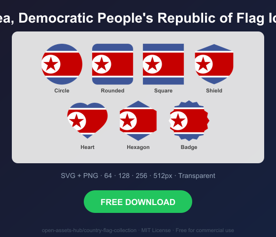

# Korea, Democratic People's Republic of Flag Icons — Free SVG & PNG in 7 Shapes

Free Korea, Democratic People's Republic of flag icons in 7 shapes. Transparent PNG (64, 128, 256, 512px) + SVG. Free for commercial use.

## Preview

      

## Download All Shapes

**[Download kp-flag-icons.zip](kp-flag-icons.zip)** — All 7 shapes, all sizes + SVG in one zip

## Download Individual

| Shape | SVG | 64px | 128px | 256px | 512px |
|---|---|---|---|---|---|
| Circle | [SVG](https://raw.githubusercontent.com/open-assets-hub/country-flag-collection/main/circle/svg/kp.svg) | [64](https://raw.githubusercontent.com/open-assets-hub/country-flag-collection/main/circle/64/kp.png) | [128](https://raw.githubusercontent.com/open-assets-hub/country-flag-collection/main/circle/128/kp.png) | [256](https://raw.githubusercontent.com/open-assets-hub/country-flag-collection/main/circle/256/kp.png) | [512](https://raw.githubusercontent.com/open-assets-hub/country-flag-collection/main/circle/512/kp.png) |
| Rounded | [SVG](https://raw.githubusercontent.com/open-assets-hub/country-flag-collection/main/rounded/svg/kp.svg) | [64](https://raw.githubusercontent.com/open-assets-hub/country-flag-collection/main/rounded/64/kp.png) | [128](https://raw.githubusercontent.com/open-assets-hub/country-flag-collection/main/rounded/128/kp.png) | [256](https://raw.githubusercontent.com/open-assets-hub/country-flag-collection/main/rounded/256/kp.png) | [512](https://raw.githubusercontent.com/open-assets-hub/country-flag-collection/main/rounded/512/kp.png) |
| Square | [SVG](https://raw.githubusercontent.com/open-assets-hub/country-flag-collection/main/square/svg/kp.svg) | [64](https://raw.githubusercontent.com/open-assets-hub/country-flag-collection/main/square/64/kp.png) | [128](https://raw.githubusercontent.com/open-assets-hub/country-flag-collection/main/square/128/kp.png) | [256](https://raw.githubusercontent.com/open-assets-hub/country-flag-collection/main/square/256/kp.png) | [512](https://raw.githubusercontent.com/open-assets-hub/country-flag-collection/main/square/512/kp.png) |
| Shield | [SVG](https://raw.githubusercontent.com/open-assets-hub/country-flag-collection/main/shield/svg/kp.svg) | [64](https://raw.githubusercontent.com/open-assets-hub/country-flag-collection/main/shield/64/kp.png) | [128](https://raw.githubusercontent.com/open-assets-hub/country-flag-collection/main/shield/128/kp.png) | [256](https://raw.githubusercontent.com/open-assets-hub/country-flag-collection/main/shield/256/kp.png) | [512](https://raw.githubusercontent.com/open-assets-hub/country-flag-collection/main/shield/512/kp.png) |
| Heart | [SVG](https://raw.githubusercontent.com/open-assets-hub/country-flag-collection/main/heart/svg/kp.svg) | [64](https://raw.githubusercontent.com/open-assets-hub/country-flag-collection/main/heart/64/kp.png) | [128](https://raw.githubusercontent.com/open-assets-hub/country-flag-collection/main/heart/128/kp.png) | [256](https://raw.githubusercontent.com/open-assets-hub/country-flag-collection/main/heart/256/kp.png) | [512](https://raw.githubusercontent.com/open-assets-hub/country-flag-collection/main/heart/512/kp.png) |
| Hexagon | [SVG](https://raw.githubusercontent.com/open-assets-hub/country-flag-collection/main/hexagon/svg/kp.svg) | [64](https://raw.githubusercontent.com/open-assets-hub/country-flag-collection/main/hexagon/64/kp.png) | [128](https://raw.githubusercontent.com/open-assets-hub/country-flag-collection/main/hexagon/128/kp.png) | [256](https://raw.githubusercontent.com/open-assets-hub/country-flag-collection/main/hexagon/256/kp.png) | [512](https://raw.githubusercontent.com/open-assets-hub/country-flag-collection/main/hexagon/512/kp.png) |
| Badge | [SVG](https://raw.githubusercontent.com/open-assets-hub/country-flag-collection/main/badge/svg/kp.svg) | [64](https://raw.githubusercontent.com/open-assets-hub/country-flag-collection/main/badge/64/kp.png) | [128](https://raw.githubusercontent.com/open-assets-hub/country-flag-collection/main/badge/128/kp.png) | [256](https://raw.githubusercontent.com/open-assets-hub/country-flag-collection/main/badge/256/kp.png) | [512](https://raw.githubusercontent.com/open-assets-hub/country-flag-collection/main/badge/512/kp.png) |

## Keywords

Korea, Democratic People's Republic of flag icon, Korea, Democratic People's Republic of flag png, Korea, Democratic People's Republic of flag svg, Korea, Democratic People's Republic of flag circle,
Korea, Democratic People's Republic of flag rounded, Korea, Democratic People's Republic of flag shield, Korea, Democratic People's Republic of flag heart,
KP flag icon, free Korea, Democratic People's Republic of flag download, Korea, Democratic People's Republic of flag transparent png

[← All countries](../../README.md)
