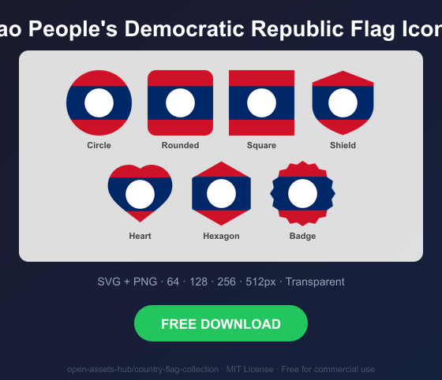
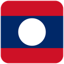

# Lao People's Democratic Republic Flag Icons — Free SVG & PNG in 7 Shapes

Free Lao People's Democratic Republic flag icons in 7 shapes. Transparent PNG (64, 128, 256, 512px) + SVG. Free for commercial use.

## Preview

      

## Download All Shapes

**[Download la-flag-icons.zip](https://raw.githubusercontent.com/open-assets-hub/country-flag-collection/main/countries/la/la-flag-icons.zip)** — All 7 shapes, all sizes + SVG in one zip

## Download Individual

| Shape | SVG | 64px | 128px | 256px | 512px |
|---|---|---|---|---|---|
| Circle | [SVG](https://raw.githubusercontent.com/open-assets-hub/country-flag-collection/main/circle/svg/la.svg) | [64](https://raw.githubusercontent.com/open-assets-hub/country-flag-collection/main/circle/64/la.png) | [128](https://raw.githubusercontent.com/open-assets-hub/country-flag-collection/main/circle/128/la.png) | [256](https://raw.githubusercontent.com/open-assets-hub/country-flag-collection/main/circle/256/la.png) | [512](https://raw.githubusercontent.com/open-assets-hub/country-flag-collection/main/circle/512/la.png) |
| Rounded | [SVG](https://raw.githubusercontent.com/open-assets-hub/country-flag-collection/main/rounded/svg/la.svg) | [64](https://raw.githubusercontent.com/open-assets-hub/country-flag-collection/main/rounded/64/la.png) | [128](https://raw.githubusercontent.com/open-assets-hub/country-flag-collection/main/rounded/128/la.png) | [256](https://raw.githubusercontent.com/open-assets-hub/country-flag-collection/main/rounded/256/la.png) | [512](https://raw.githubusercontent.com/open-assets-hub/country-flag-collection/main/rounded/512/la.png) |
| Square | [SVG](https://raw.githubusercontent.com/open-assets-hub/country-flag-collection/main/square/svg/la.svg) | [64](https://raw.githubusercontent.com/open-assets-hub/country-flag-collection/main/square/64/la.png) | [128](https://raw.githubusercontent.com/open-assets-hub/country-flag-collection/main/square/128/la.png) | [256](https://raw.githubusercontent.com/open-assets-hub/country-flag-collection/main/square/256/la.png) | [512](https://raw.githubusercontent.com/open-assets-hub/country-flag-collection/main/square/512/la.png) |
| Shield | [SVG](https://raw.githubusercontent.com/open-assets-hub/country-flag-collection/main/shield/svg/la.svg) | [64](https://raw.githubusercontent.com/open-assets-hub/country-flag-collection/main/shield/64/la.png) | [128](https://raw.githubusercontent.com/open-assets-hub/country-flag-collection/main/shield/128/la.png) | [256](https://raw.githubusercontent.com/open-assets-hub/country-flag-collection/main/shield/256/la.png) | [512](https://raw.githubusercontent.com/open-assets-hub/country-flag-collection/main/shield/512/la.png) |
| Heart | [SVG](https://raw.githubusercontent.com/open-assets-hub/country-flag-collection/main/heart/svg/la.svg) | [64](https://raw.githubusercontent.com/open-assets-hub/country-flag-collection/main/heart/64/la.png) | [128](https://raw.githubusercontent.com/open-assets-hub/country-flag-collection/main/heart/128/la.png) | [256](https://raw.githubusercontent.com/open-assets-hub/country-flag-collection/main/heart/256/la.png) | [512](https://raw.githubusercontent.com/open-assets-hub/country-flag-collection/main/heart/512/la.png) |
| Hexagon | [SVG](https://raw.githubusercontent.com/open-assets-hub/country-flag-collection/main/hexagon/svg/la.svg) | [64](https://raw.githubusercontent.com/open-assets-hub/country-flag-collection/main/hexagon/64/la.png) | [128](https://raw.githubusercontent.com/open-assets-hub/country-flag-collection/main/hexagon/128/la.png) | [256](https://raw.githubusercontent.com/open-assets-hub/country-flag-collection/main/hexagon/256/la.png) | [512](https://raw.githubusercontent.com/open-assets-hub/country-flag-collection/main/hexagon/512/la.png) |
| Badge | [SVG](https://raw.githubusercontent.com/open-assets-hub/country-flag-collection/main/badge/svg/la.svg) | [64](https://raw.githubusercontent.com/open-assets-hub/country-flag-collection/main/badge/64/la.png) | [128](https://raw.githubusercontent.com/open-assets-hub/country-flag-collection/main/badge/128/la.png) | [256](https://raw.githubusercontent.com/open-assets-hub/country-flag-collection/main/badge/256/la.png) | [512](https://raw.githubusercontent.com/open-assets-hub/country-flag-collection/main/badge/512/la.png) |

## Keywords

Lao People's Democratic Republic flag icon, Lao People's Democratic Republic flag png, Lao People's Democratic Republic flag svg, Lao People's Democratic Republic flag circle,
Lao People's Democratic Republic flag rounded, Lao People's Democratic Republic flag shield, Lao People's Democratic Republic flag heart,
LA flag icon, free Lao People's Democratic Republic flag download, Lao People's Democratic Republic flag transparent png

[← All countries](../../README.md)
