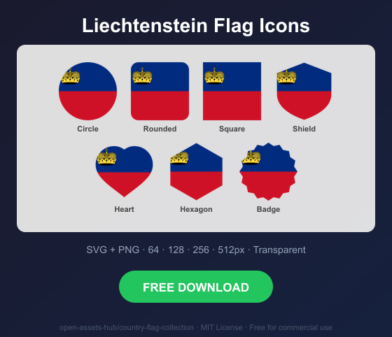
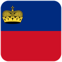
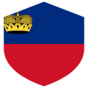
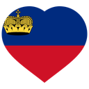
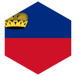
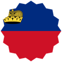

# Liechtenstein Flag Icons — Free SVG & PNG in 7 Shapes

Free Liechtenstein flag icons in 7 shapes. Transparent PNG (64, 128, 256, 512px) + SVG. Free for commercial use.

## Preview

      

## Download All Shapes

**[Download li-flag-icons.zip](li-flag-icons.zip)** — All 7 shapes, all sizes + SVG in one zip

## Download Individual

| Shape | SVG | 64px | 128px | 256px | 512px |
|---|---|---|---|---|---|
| Circle | [SVG](https://raw.githubusercontent.com/open-assets-hub/country-flag-collection/main/circle/svg/li.svg) | [64](https://raw.githubusercontent.com/open-assets-hub/country-flag-collection/main/circle/64/li.png) | [128](https://raw.githubusercontent.com/open-assets-hub/country-flag-collection/main/circle/128/li.png) | [256](https://raw.githubusercontent.com/open-assets-hub/country-flag-collection/main/circle/256/li.png) | [512](https://raw.githubusercontent.com/open-assets-hub/country-flag-collection/main/circle/512/li.png) |
| Rounded | [SVG](https://raw.githubusercontent.com/open-assets-hub/country-flag-collection/main/rounded/svg/li.svg) | [64](https://raw.githubusercontent.com/open-assets-hub/country-flag-collection/main/rounded/64/li.png) | [128](https://raw.githubusercontent.com/open-assets-hub/country-flag-collection/main/rounded/128/li.png) | [256](https://raw.githubusercontent.com/open-assets-hub/country-flag-collection/main/rounded/256/li.png) | [512](https://raw.githubusercontent.com/open-assets-hub/country-flag-collection/main/rounded/512/li.png) |
| Square | [SVG](https://raw.githubusercontent.com/open-assets-hub/country-flag-collection/main/square/svg/li.svg) | [64](https://raw.githubusercontent.com/open-assets-hub/country-flag-collection/main/square/64/li.png) | [128](https://raw.githubusercontent.com/open-assets-hub/country-flag-collection/main/square/128/li.png) | [256](https://raw.githubusercontent.com/open-assets-hub/country-flag-collection/main/square/256/li.png) | [512](https://raw.githubusercontent.com/open-assets-hub/country-flag-collection/main/square/512/li.png) |
| Shield | [SVG](https://raw.githubusercontent.com/open-assets-hub/country-flag-collection/main/shield/svg/li.svg) | [64](https://raw.githubusercontent.com/open-assets-hub/country-flag-collection/main/shield/64/li.png) | [128](https://raw.githubusercontent.com/open-assets-hub/country-flag-collection/main/shield/128/li.png) | [256](https://raw.githubusercontent.com/open-assets-hub/country-flag-collection/main/shield/256/li.png) | [512](https://raw.githubusercontent.com/open-assets-hub/country-flag-collection/main/shield/512/li.png) |
| Heart | [SVG](https://raw.githubusercontent.com/open-assets-hub/country-flag-collection/main/heart/svg/li.svg) | [64](https://raw.githubusercontent.com/open-assets-hub/country-flag-collection/main/heart/64/li.png) | [128](https://raw.githubusercontent.com/open-assets-hub/country-flag-collection/main/heart/128/li.png) | [256](https://raw.githubusercontent.com/open-assets-hub/country-flag-collection/main/heart/256/li.png) | [512](https://raw.githubusercontent.com/open-assets-hub/country-flag-collection/main/heart/512/li.png) |
| Hexagon | [SVG](https://raw.githubusercontent.com/open-assets-hub/country-flag-collection/main/hexagon/svg/li.svg) | [64](https://raw.githubusercontent.com/open-assets-hub/country-flag-collection/main/hexagon/64/li.png) | [128](https://raw.githubusercontent.com/open-assets-hub/country-flag-collection/main/hexagon/128/li.png) | [256](https://raw.githubusercontent.com/open-assets-hub/country-flag-collection/main/hexagon/256/li.png) | [512](https://raw.githubusercontent.com/open-assets-hub/country-flag-collection/main/hexagon/512/li.png) |
| Badge | [SVG](https://raw.githubusercontent.com/open-assets-hub/country-flag-collection/main/badge/svg/li.svg) | [64](https://raw.githubusercontent.com/open-assets-hub/country-flag-collection/main/badge/64/li.png) | [128](https://raw.githubusercontent.com/open-assets-hub/country-flag-collection/main/badge/128/li.png) | [256](https://raw.githubusercontent.com/open-assets-hub/country-flag-collection/main/badge/256/li.png) | [512](https://raw.githubusercontent.com/open-assets-hub/country-flag-collection/main/badge/512/li.png) |

## Keywords

Liechtenstein flag icon, Liechtenstein flag png, Liechtenstein flag svg, Liechtenstein flag circle,
Liechtenstein flag rounded, Liechtenstein flag shield, Liechtenstein flag heart,
LI flag icon, free Liechtenstein flag download, Liechtenstein flag transparent png

[← All countries](../../README.md)
