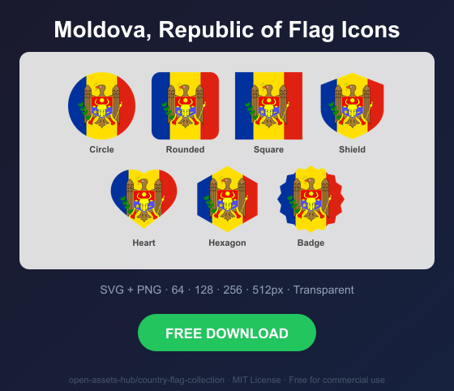
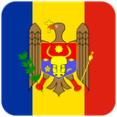
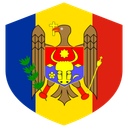
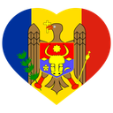
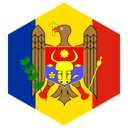
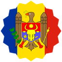

# Moldova, Republic of Flag Icons — Free SVG & PNG in 7 Shapes

Free Moldova, Republic of flag icons in 7 shapes. Transparent PNG (64, 128, 256, 512px) + SVG. Free for commercial use.

## Preview

      

## Download All Shapes

**[Download md-flag-icons.zip](https://raw.githubusercontent.com/open-assets-hub/country-flag-collection/main/countries/md/md-flag-icons.zip)** — All 7 shapes, all sizes + SVG in one zip

## Download Individual

| Shape | SVG | 64px | 128px | 256px | 512px |
|---|---|---|---|---|---|
| Circle | [SVG](https://raw.githubusercontent.com/open-assets-hub/country-flag-collection/main/circle/svg/md.svg) | [64](https://raw.githubusercontent.com/open-assets-hub/country-flag-collection/main/circle/64/md.png) | [128](https://raw.githubusercontent.com/open-assets-hub/country-flag-collection/main/circle/128/md.png) | [256](https://raw.githubusercontent.com/open-assets-hub/country-flag-collection/main/circle/256/md.png) | [512](https://raw.githubusercontent.com/open-assets-hub/country-flag-collection/main/circle/512/md.png) |
| Rounded | [SVG](https://raw.githubusercontent.com/open-assets-hub/country-flag-collection/main/rounded/svg/md.svg) | [64](https://raw.githubusercontent.com/open-assets-hub/country-flag-collection/main/rounded/64/md.png) | [128](https://raw.githubusercontent.com/open-assets-hub/country-flag-collection/main/rounded/128/md.png) | [256](https://raw.githubusercontent.com/open-assets-hub/country-flag-collection/main/rounded/256/md.png) | [512](https://raw.githubusercontent.com/open-assets-hub/country-flag-collection/main/rounded/512/md.png) |
| Square | [SVG](https://raw.githubusercontent.com/open-assets-hub/country-flag-collection/main/square/svg/md.svg) | [64](https://raw.githubusercontent.com/open-assets-hub/country-flag-collection/main/square/64/md.png) | [128](https://raw.githubusercontent.com/open-assets-hub/country-flag-collection/main/square/128/md.png) | [256](https://raw.githubusercontent.com/open-assets-hub/country-flag-collection/main/square/256/md.png) | [512](https://raw.githubusercontent.com/open-assets-hub/country-flag-collection/main/square/512/md.png) |
| Shield | [SVG](https://raw.githubusercontent.com/open-assets-hub/country-flag-collection/main/shield/svg/md.svg) | [64](https://raw.githubusercontent.com/open-assets-hub/country-flag-collection/main/shield/64/md.png) | [128](https://raw.githubusercontent.com/open-assets-hub/country-flag-collection/main/shield/128/md.png) | [256](https://raw.githubusercontent.com/open-assets-hub/country-flag-collection/main/shield/256/md.png) | [512](https://raw.githubusercontent.com/open-assets-hub/country-flag-collection/main/shield/512/md.png) |
| Heart | [SVG](https://raw.githubusercontent.com/open-assets-hub/country-flag-collection/main/heart/svg/md.svg) | [64](https://raw.githubusercontent.com/open-assets-hub/country-flag-collection/main/heart/64/md.png) | [128](https://raw.githubusercontent.com/open-assets-hub/country-flag-collection/main/heart/128/md.png) | [256](https://raw.githubusercontent.com/open-assets-hub/country-flag-collection/main/heart/256/md.png) | [512](https://raw.githubusercontent.com/open-assets-hub/country-flag-collection/main/heart/512/md.png) |
| Hexagon | [SVG](https://raw.githubusercontent.com/open-assets-hub/country-flag-collection/main/hexagon/svg/md.svg) | [64](https://raw.githubusercontent.com/open-assets-hub/country-flag-collection/main/hexagon/64/md.png) | [128](https://raw.githubusercontent.com/open-assets-hub/country-flag-collection/main/hexagon/128/md.png) | [256](https://raw.githubusercontent.com/open-assets-hub/country-flag-collection/main/hexagon/256/md.png) | [512](https://raw.githubusercontent.com/open-assets-hub/country-flag-collection/main/hexagon/512/md.png) |
| Badge | [SVG](https://raw.githubusercontent.com/open-assets-hub/country-flag-collection/main/badge/svg/md.svg) | [64](https://raw.githubusercontent.com/open-assets-hub/country-flag-collection/main/badge/64/md.png) | [128](https://raw.githubusercontent.com/open-assets-hub/country-flag-collection/main/badge/128/md.png) | [256](https://raw.githubusercontent.com/open-assets-hub/country-flag-collection/main/badge/256/md.png) | [512](https://raw.githubusercontent.com/open-assets-hub/country-flag-collection/main/badge/512/md.png) |

## Keywords

Moldova, Republic of flag icon, Moldova, Republic of flag png, Moldova, Republic of flag svg, Moldova, Republic of flag circle,
Moldova, Republic of flag rounded, Moldova, Republic of flag shield, Moldova, Republic of flag heart,
MD flag icon, free Moldova, Republic of flag download, Moldova, Republic of flag transparent png

[← All countries](../../README.md)
