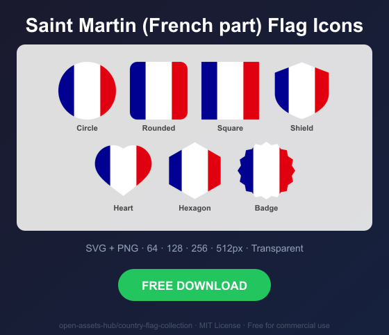

# Saint Martin (French part) Flag Icons — Free SVG & PNG in 7 Shapes

Free Saint Martin (French part) flag icons in 7 shapes. Transparent PNG (64, 128, 256, 512px) + SVG. Free for commercial use.

## Preview

      

## Download All Shapes

**[Download mf-flag-icons.zip](mf-flag-icons.zip)** — All 7 shapes, all sizes + SVG in one zip

## Download Individual

| Shape | SVG | 64px | 128px | 256px | 512px |
|---|---|---|---|---|---|
| Circle | [SVG](https://raw.githubusercontent.com/open-assets-hub/country-flag-collection/main/circle/svg/mf.svg) | [64](https://raw.githubusercontent.com/open-assets-hub/country-flag-collection/main/circle/64/mf.png) | [128](https://raw.githubusercontent.com/open-assets-hub/country-flag-collection/main/circle/128/mf.png) | [256](https://raw.githubusercontent.com/open-assets-hub/country-flag-collection/main/circle/256/mf.png) | [512](https://raw.githubusercontent.com/open-assets-hub/country-flag-collection/main/circle/512/mf.png) |
| Rounded | [SVG](https://raw.githubusercontent.com/open-assets-hub/country-flag-collection/main/rounded/svg/mf.svg) | [64](https://raw.githubusercontent.com/open-assets-hub/country-flag-collection/main/rounded/64/mf.png) | [128](https://raw.githubusercontent.com/open-assets-hub/country-flag-collection/main/rounded/128/mf.png) | [256](https://raw.githubusercontent.com/open-assets-hub/country-flag-collection/main/rounded/256/mf.png) | [512](https://raw.githubusercontent.com/open-assets-hub/country-flag-collection/main/rounded/512/mf.png) |
| Square | [SVG](https://raw.githubusercontent.com/open-assets-hub/country-flag-collection/main/square/svg/mf.svg) | [64](https://raw.githubusercontent.com/open-assets-hub/country-flag-collection/main/square/64/mf.png) | [128](https://raw.githubusercontent.com/open-assets-hub/country-flag-collection/main/square/128/mf.png) | [256](https://raw.githubusercontent.com/open-assets-hub/country-flag-collection/main/square/256/mf.png) | [512](https://raw.githubusercontent.com/open-assets-hub/country-flag-collection/main/square/512/mf.png) |
| Shield | [SVG](https://raw.githubusercontent.com/open-assets-hub/country-flag-collection/main/shield/svg/mf.svg) | [64](https://raw.githubusercontent.com/open-assets-hub/country-flag-collection/main/shield/64/mf.png) | [128](https://raw.githubusercontent.com/open-assets-hub/country-flag-collection/main/shield/128/mf.png) | [256](https://raw.githubusercontent.com/open-assets-hub/country-flag-collection/main/shield/256/mf.png) | [512](https://raw.githubusercontent.com/open-assets-hub/country-flag-collection/main/shield/512/mf.png) |
| Heart | [SVG](https://raw.githubusercontent.com/open-assets-hub/country-flag-collection/main/heart/svg/mf.svg) | [64](https://raw.githubusercontent.com/open-assets-hub/country-flag-collection/main/heart/64/mf.png) | [128](https://raw.githubusercontent.com/open-assets-hub/country-flag-collection/main/heart/128/mf.png) | [256](https://raw.githubusercontent.com/open-assets-hub/country-flag-collection/main/heart/256/mf.png) | [512](https://raw.githubusercontent.com/open-assets-hub/country-flag-collection/main/heart/512/mf.png) |
| Hexagon | [SVG](https://raw.githubusercontent.com/open-assets-hub/country-flag-collection/main/hexagon/svg/mf.svg) | [64](https://raw.githubusercontent.com/open-assets-hub/country-flag-collection/main/hexagon/64/mf.png) | [128](https://raw.githubusercontent.com/open-assets-hub/country-flag-collection/main/hexagon/128/mf.png) | [256](https://raw.githubusercontent.com/open-assets-hub/country-flag-collection/main/hexagon/256/mf.png) | [512](https://raw.githubusercontent.com/open-assets-hub/country-flag-collection/main/hexagon/512/mf.png) |
| Badge | [SVG](https://raw.githubusercontent.com/open-assets-hub/country-flag-collection/main/badge/svg/mf.svg) | [64](https://raw.githubusercontent.com/open-assets-hub/country-flag-collection/main/badge/64/mf.png) | [128](https://raw.githubusercontent.com/open-assets-hub/country-flag-collection/main/badge/128/mf.png) | [256](https://raw.githubusercontent.com/open-assets-hub/country-flag-collection/main/badge/256/mf.png) | [512](https://raw.githubusercontent.com/open-assets-hub/country-flag-collection/main/badge/512/mf.png) |

## Keywords

Saint Martin (French part) flag icon, Saint Martin (French part) flag png, Saint Martin (French part) flag svg, Saint Martin (French part) flag circle,
Saint Martin (French part) flag rounded, Saint Martin (French part) flag shield, Saint Martin (French part) flag heart,
MF flag icon, free Saint Martin (French part) flag download, Saint Martin (French part) flag transparent png

[← All countries](../../README.md)
