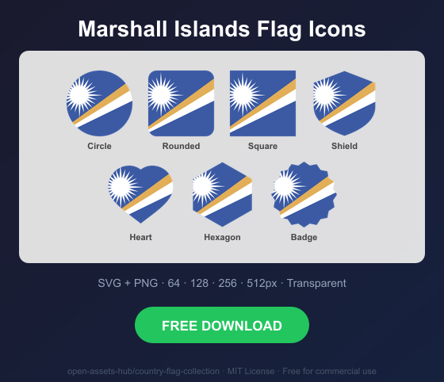
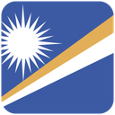
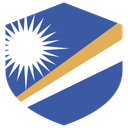
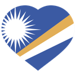
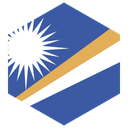
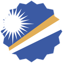

# Marshall Islands Flag Icons — Free SVG & PNG in 7 Shapes

Free Marshall Islands flag icons in 7 shapes. Transparent PNG (64, 128, 256, 512px) + SVG. Free for commercial use.

## Preview

      

## Download All Shapes

**[Download mh-flag-icons.zip](https://raw.githubusercontent.com/open-assets-hub/country-flag-collection/main/countries/mh/mh-flag-icons.zip)** — All 7 shapes, all sizes + SVG in one zip

## Download Individual

| Shape | SVG | 64px | 128px | 256px | 512px |
|---|---|---|---|---|---|
| Circle | [SVG](https://raw.githubusercontent.com/open-assets-hub/country-flag-collection/main/circle/svg/mh.svg) | [64](https://raw.githubusercontent.com/open-assets-hub/country-flag-collection/main/circle/64/mh.png) | [128](https://raw.githubusercontent.com/open-assets-hub/country-flag-collection/main/circle/128/mh.png) | [256](https://raw.githubusercontent.com/open-assets-hub/country-flag-collection/main/circle/256/mh.png) | [512](https://raw.githubusercontent.com/open-assets-hub/country-flag-collection/main/circle/512/mh.png) |
| Rounded | [SVG](https://raw.githubusercontent.com/open-assets-hub/country-flag-collection/main/rounded/svg/mh.svg) | [64](https://raw.githubusercontent.com/open-assets-hub/country-flag-collection/main/rounded/64/mh.png) | [128](https://raw.githubusercontent.com/open-assets-hub/country-flag-collection/main/rounded/128/mh.png) | [256](https://raw.githubusercontent.com/open-assets-hub/country-flag-collection/main/rounded/256/mh.png) | [512](https://raw.githubusercontent.com/open-assets-hub/country-flag-collection/main/rounded/512/mh.png) |
| Square | [SVG](https://raw.githubusercontent.com/open-assets-hub/country-flag-collection/main/square/svg/mh.svg) | [64](https://raw.githubusercontent.com/open-assets-hub/country-flag-collection/main/square/64/mh.png) | [128](https://raw.githubusercontent.com/open-assets-hub/country-flag-collection/main/square/128/mh.png) | [256](https://raw.githubusercontent.com/open-assets-hub/country-flag-collection/main/square/256/mh.png) | [512](https://raw.githubusercontent.com/open-assets-hub/country-flag-collection/main/square/512/mh.png) |
| Shield | [SVG](https://raw.githubusercontent.com/open-assets-hub/country-flag-collection/main/shield/svg/mh.svg) | [64](https://raw.githubusercontent.com/open-assets-hub/country-flag-collection/main/shield/64/mh.png) | [128](https://raw.githubusercontent.com/open-assets-hub/country-flag-collection/main/shield/128/mh.png) | [256](https://raw.githubusercontent.com/open-assets-hub/country-flag-collection/main/shield/256/mh.png) | [512](https://raw.githubusercontent.com/open-assets-hub/country-flag-collection/main/shield/512/mh.png) |
| Heart | [SVG](https://raw.githubusercontent.com/open-assets-hub/country-flag-collection/main/heart/svg/mh.svg) | [64](https://raw.githubusercontent.com/open-assets-hub/country-flag-collection/main/heart/64/mh.png) | [128](https://raw.githubusercontent.com/open-assets-hub/country-flag-collection/main/heart/128/mh.png) | [256](https://raw.githubusercontent.com/open-assets-hub/country-flag-collection/main/heart/256/mh.png) | [512](https://raw.githubusercontent.com/open-assets-hub/country-flag-collection/main/heart/512/mh.png) |
| Hexagon | [SVG](https://raw.githubusercontent.com/open-assets-hub/country-flag-collection/main/hexagon/svg/mh.svg) | [64](https://raw.githubusercontent.com/open-assets-hub/country-flag-collection/main/hexagon/64/mh.png) | [128](https://raw.githubusercontent.com/open-assets-hub/country-flag-collection/main/hexagon/128/mh.png) | [256](https://raw.githubusercontent.com/open-assets-hub/country-flag-collection/main/hexagon/256/mh.png) | [512](https://raw.githubusercontent.com/open-assets-hub/country-flag-collection/main/hexagon/512/mh.png) |
| Badge | [SVG](https://raw.githubusercontent.com/open-assets-hub/country-flag-collection/main/badge/svg/mh.svg) | [64](https://raw.githubusercontent.com/open-assets-hub/country-flag-collection/main/badge/64/mh.png) | [128](https://raw.githubusercontent.com/open-assets-hub/country-flag-collection/main/badge/128/mh.png) | [256](https://raw.githubusercontent.com/open-assets-hub/country-flag-collection/main/badge/256/mh.png) | [512](https://raw.githubusercontent.com/open-assets-hub/country-flag-collection/main/badge/512/mh.png) |

## Keywords

Marshall Islands flag icon, Marshall Islands flag png, Marshall Islands flag svg, Marshall Islands flag circle,
Marshall Islands flag rounded, Marshall Islands flag shield, Marshall Islands flag heart,
MH flag icon, free Marshall Islands flag download, Marshall Islands flag transparent png

[← All countries](../../README.md)
