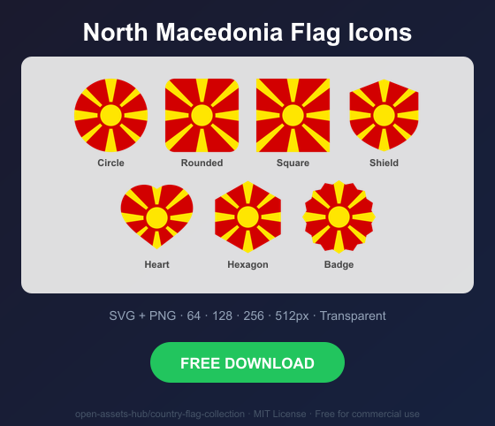
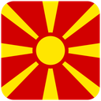
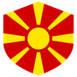
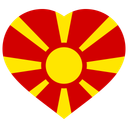
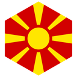
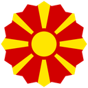

# North Macedonia Flag Icons — Free SVG & PNG in 7 Shapes

Free North Macedonia flag icons in 7 shapes. Transparent PNG (64, 128, 256, 512px) + SVG. Free for commercial use.

## Preview

      

## Download All Shapes

**[Download mk-flag-icons.zip](mk-flag-icons.zip)** — All 7 shapes, all sizes + SVG in one zip

## Download Individual

| Shape | SVG | 64px | 128px | 256px | 512px |
|---|---|---|---|---|---|
| Circle | [SVG](https://raw.githubusercontent.com/open-assets-hub/country-flag-collection/main/circle/svg/mk.svg) | [64](https://raw.githubusercontent.com/open-assets-hub/country-flag-collection/main/circle/64/mk.png) | [128](https://raw.githubusercontent.com/open-assets-hub/country-flag-collection/main/circle/128/mk.png) | [256](https://raw.githubusercontent.com/open-assets-hub/country-flag-collection/main/circle/256/mk.png) | [512](https://raw.githubusercontent.com/open-assets-hub/country-flag-collection/main/circle/512/mk.png) |
| Rounded | [SVG](https://raw.githubusercontent.com/open-assets-hub/country-flag-collection/main/rounded/svg/mk.svg) | [64](https://raw.githubusercontent.com/open-assets-hub/country-flag-collection/main/rounded/64/mk.png) | [128](https://raw.githubusercontent.com/open-assets-hub/country-flag-collection/main/rounded/128/mk.png) | [256](https://raw.githubusercontent.com/open-assets-hub/country-flag-collection/main/rounded/256/mk.png) | [512](https://raw.githubusercontent.com/open-assets-hub/country-flag-collection/main/rounded/512/mk.png) |
| Square | [SVG](https://raw.githubusercontent.com/open-assets-hub/country-flag-collection/main/square/svg/mk.svg) | [64](https://raw.githubusercontent.com/open-assets-hub/country-flag-collection/main/square/64/mk.png) | [128](https://raw.githubusercontent.com/open-assets-hub/country-flag-collection/main/square/128/mk.png) | [256](https://raw.githubusercontent.com/open-assets-hub/country-flag-collection/main/square/256/mk.png) | [512](https://raw.githubusercontent.com/open-assets-hub/country-flag-collection/main/square/512/mk.png) |
| Shield | [SVG](https://raw.githubusercontent.com/open-assets-hub/country-flag-collection/main/shield/svg/mk.svg) | [64](https://raw.githubusercontent.com/open-assets-hub/country-flag-collection/main/shield/64/mk.png) | [128](https://raw.githubusercontent.com/open-assets-hub/country-flag-collection/main/shield/128/mk.png) | [256](https://raw.githubusercontent.com/open-assets-hub/country-flag-collection/main/shield/256/mk.png) | [512](https://raw.githubusercontent.com/open-assets-hub/country-flag-collection/main/shield/512/mk.png) |
| Heart | [SVG](https://raw.githubusercontent.com/open-assets-hub/country-flag-collection/main/heart/svg/mk.svg) | [64](https://raw.githubusercontent.com/open-assets-hub/country-flag-collection/main/heart/64/mk.png) | [128](https://raw.githubusercontent.com/open-assets-hub/country-flag-collection/main/heart/128/mk.png) | [256](https://raw.githubusercontent.com/open-assets-hub/country-flag-collection/main/heart/256/mk.png) | [512](https://raw.githubusercontent.com/open-assets-hub/country-flag-collection/main/heart/512/mk.png) |
| Hexagon | [SVG](https://raw.githubusercontent.com/open-assets-hub/country-flag-collection/main/hexagon/svg/mk.svg) | [64](https://raw.githubusercontent.com/open-assets-hub/country-flag-collection/main/hexagon/64/mk.png) | [128](https://raw.githubusercontent.com/open-assets-hub/country-flag-collection/main/hexagon/128/mk.png) | [256](https://raw.githubusercontent.com/open-assets-hub/country-flag-collection/main/hexagon/256/mk.png) | [512](https://raw.githubusercontent.com/open-assets-hub/country-flag-collection/main/hexagon/512/mk.png) |
| Badge | [SVG](https://raw.githubusercontent.com/open-assets-hub/country-flag-collection/main/badge/svg/mk.svg) | [64](https://raw.githubusercontent.com/open-assets-hub/country-flag-collection/main/badge/64/mk.png) | [128](https://raw.githubusercontent.com/open-assets-hub/country-flag-collection/main/badge/128/mk.png) | [256](https://raw.githubusercontent.com/open-assets-hub/country-flag-collection/main/badge/256/mk.png) | [512](https://raw.githubusercontent.com/open-assets-hub/country-flag-collection/main/badge/512/mk.png) |

## Keywords

North Macedonia flag icon, North Macedonia flag png, North Macedonia flag svg, North Macedonia flag circle,
North Macedonia flag rounded, North Macedonia flag shield, North Macedonia flag heart,
MK flag icon, free North Macedonia flag download, North Macedonia flag transparent png

[← All countries](../../README.md)
