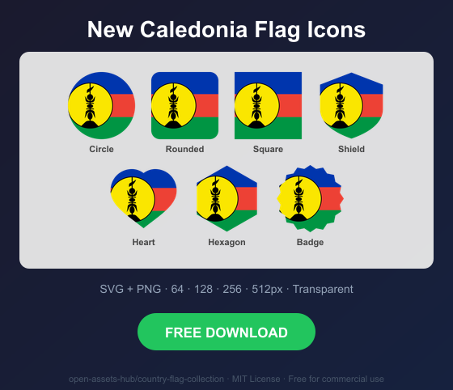
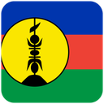
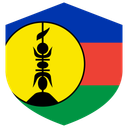
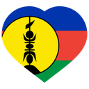
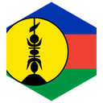
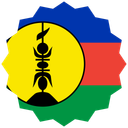

# New Caledonia Flag Icons — Free SVG & PNG in 7 Shapes

Free New Caledonia flag icons in 7 shapes. Transparent PNG (64, 128, 256, 512px) + SVG. Free for commercial use.

## Preview

      

## Download All Shapes

**[Download nc-flag-icons.zip](https://raw.githubusercontent.com/open-assets-hub/country-flag-collection/main/countries/nc/nc-flag-icons.zip)** — All 7 shapes, all sizes + SVG in one zip

## Download Individual

| Shape | SVG | 64px | 128px | 256px | 512px |
|---|---|---|---|---|---|
| Circle | [SVG](https://raw.githubusercontent.com/open-assets-hub/country-flag-collection/main/circle/svg/nc.svg) | [64](https://raw.githubusercontent.com/open-assets-hub/country-flag-collection/main/circle/64/nc.png) | [128](https://raw.githubusercontent.com/open-assets-hub/country-flag-collection/main/circle/128/nc.png) | [256](https://raw.githubusercontent.com/open-assets-hub/country-flag-collection/main/circle/256/nc.png) | [512](https://raw.githubusercontent.com/open-assets-hub/country-flag-collection/main/circle/512/nc.png) |
| Rounded | [SVG](https://raw.githubusercontent.com/open-assets-hub/country-flag-collection/main/rounded/svg/nc.svg) | [64](https://raw.githubusercontent.com/open-assets-hub/country-flag-collection/main/rounded/64/nc.png) | [128](https://raw.githubusercontent.com/open-assets-hub/country-flag-collection/main/rounded/128/nc.png) | [256](https://raw.githubusercontent.com/open-assets-hub/country-flag-collection/main/rounded/256/nc.png) | [512](https://raw.githubusercontent.com/open-assets-hub/country-flag-collection/main/rounded/512/nc.png) |
| Square | [SVG](https://raw.githubusercontent.com/open-assets-hub/country-flag-collection/main/square/svg/nc.svg) | [64](https://raw.githubusercontent.com/open-assets-hub/country-flag-collection/main/square/64/nc.png) | [128](https://raw.githubusercontent.com/open-assets-hub/country-flag-collection/main/square/128/nc.png) | [256](https://raw.githubusercontent.com/open-assets-hub/country-flag-collection/main/square/256/nc.png) | [512](https://raw.githubusercontent.com/open-assets-hub/country-flag-collection/main/square/512/nc.png) |
| Shield | [SVG](https://raw.githubusercontent.com/open-assets-hub/country-flag-collection/main/shield/svg/nc.svg) | [64](https://raw.githubusercontent.com/open-assets-hub/country-flag-collection/main/shield/64/nc.png) | [128](https://raw.githubusercontent.com/open-assets-hub/country-flag-collection/main/shield/128/nc.png) | [256](https://raw.githubusercontent.com/open-assets-hub/country-flag-collection/main/shield/256/nc.png) | [512](https://raw.githubusercontent.com/open-assets-hub/country-flag-collection/main/shield/512/nc.png) |
| Heart | [SVG](https://raw.githubusercontent.com/open-assets-hub/country-flag-collection/main/heart/svg/nc.svg) | [64](https://raw.githubusercontent.com/open-assets-hub/country-flag-collection/main/heart/64/nc.png) | [128](https://raw.githubusercontent.com/open-assets-hub/country-flag-collection/main/heart/128/nc.png) | [256](https://raw.githubusercontent.com/open-assets-hub/country-flag-collection/main/heart/256/nc.png) | [512](https://raw.githubusercontent.com/open-assets-hub/country-flag-collection/main/heart/512/nc.png) |
| Hexagon | [SVG](https://raw.githubusercontent.com/open-assets-hub/country-flag-collection/main/hexagon/svg/nc.svg) | [64](https://raw.githubusercontent.com/open-assets-hub/country-flag-collection/main/hexagon/64/nc.png) | [128](https://raw.githubusercontent.com/open-assets-hub/country-flag-collection/main/hexagon/128/nc.png) | [256](https://raw.githubusercontent.com/open-assets-hub/country-flag-collection/main/hexagon/256/nc.png) | [512](https://raw.githubusercontent.com/open-assets-hub/country-flag-collection/main/hexagon/512/nc.png) |
| Badge | [SVG](https://raw.githubusercontent.com/open-assets-hub/country-flag-collection/main/badge/svg/nc.svg) | [64](https://raw.githubusercontent.com/open-assets-hub/country-flag-collection/main/badge/64/nc.png) | [128](https://raw.githubusercontent.com/open-assets-hub/country-flag-collection/main/badge/128/nc.png) | [256](https://raw.githubusercontent.com/open-assets-hub/country-flag-collection/main/badge/256/nc.png) | [512](https://raw.githubusercontent.com/open-assets-hub/country-flag-collection/main/badge/512/nc.png) |

## Keywords

New Caledonia flag icon, New Caledonia flag png, New Caledonia flag svg, New Caledonia flag circle,
New Caledonia flag rounded, New Caledonia flag shield, New Caledonia flag heart,
NC flag icon, free New Caledonia flag download, New Caledonia flag transparent png

[← All countries](../../README.md)
