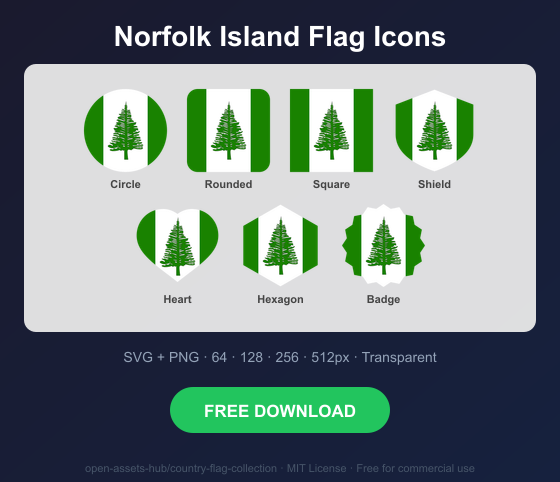
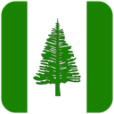
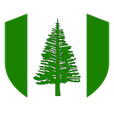
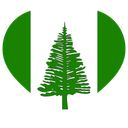
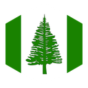
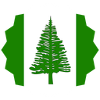

# Norfolk Island Flag Icons — Free SVG & PNG in 7 Shapes

Free Norfolk Island flag icons in 7 shapes. Transparent PNG (64, 128, 256, 512px) + SVG. Free for commercial use.

## Preview

      

## Download All Shapes

**[Download nf-flag-icons.zip](https://raw.githubusercontent.com/open-assets-hub/country-flag-collection/main/countries/nf/nf-flag-icons.zip)** — All 7 shapes, all sizes + SVG in one zip

## Download Individual

| Shape | SVG | 64px | 128px | 256px | 512px |
|---|---|---|---|---|---|
| Circle | [SVG](https://raw.githubusercontent.com/open-assets-hub/country-flag-collection/main/circle/svg/nf.svg) | [64](https://raw.githubusercontent.com/open-assets-hub/country-flag-collection/main/circle/64/nf.png) | [128](https://raw.githubusercontent.com/open-assets-hub/country-flag-collection/main/circle/128/nf.png) | [256](https://raw.githubusercontent.com/open-assets-hub/country-flag-collection/main/circle/256/nf.png) | [512](https://raw.githubusercontent.com/open-assets-hub/country-flag-collection/main/circle/512/nf.png) |
| Rounded | [SVG](https://raw.githubusercontent.com/open-assets-hub/country-flag-collection/main/rounded/svg/nf.svg) | [64](https://raw.githubusercontent.com/open-assets-hub/country-flag-collection/main/rounded/64/nf.png) | [128](https://raw.githubusercontent.com/open-assets-hub/country-flag-collection/main/rounded/128/nf.png) | [256](https://raw.githubusercontent.com/open-assets-hub/country-flag-collection/main/rounded/256/nf.png) | [512](https://raw.githubusercontent.com/open-assets-hub/country-flag-collection/main/rounded/512/nf.png) |
| Square | [SVG](https://raw.githubusercontent.com/open-assets-hub/country-flag-collection/main/square/svg/nf.svg) | [64](https://raw.githubusercontent.com/open-assets-hub/country-flag-collection/main/square/64/nf.png) | [128](https://raw.githubusercontent.com/open-assets-hub/country-flag-collection/main/square/128/nf.png) | [256](https://raw.githubusercontent.com/open-assets-hub/country-flag-collection/main/square/256/nf.png) | [512](https://raw.githubusercontent.com/open-assets-hub/country-flag-collection/main/square/512/nf.png) |
| Shield | [SVG](https://raw.githubusercontent.com/open-assets-hub/country-flag-collection/main/shield/svg/nf.svg) | [64](https://raw.githubusercontent.com/open-assets-hub/country-flag-collection/main/shield/64/nf.png) | [128](https://raw.githubusercontent.com/open-assets-hub/country-flag-collection/main/shield/128/nf.png) | [256](https://raw.githubusercontent.com/open-assets-hub/country-flag-collection/main/shield/256/nf.png) | [512](https://raw.githubusercontent.com/open-assets-hub/country-flag-collection/main/shield/512/nf.png) |
| Heart | [SVG](https://raw.githubusercontent.com/open-assets-hub/country-flag-collection/main/heart/svg/nf.svg) | [64](https://raw.githubusercontent.com/open-assets-hub/country-flag-collection/main/heart/64/nf.png) | [128](https://raw.githubusercontent.com/open-assets-hub/country-flag-collection/main/heart/128/nf.png) | [256](https://raw.githubusercontent.com/open-assets-hub/country-flag-collection/main/heart/256/nf.png) | [512](https://raw.githubusercontent.com/open-assets-hub/country-flag-collection/main/heart/512/nf.png) |
| Hexagon | [SVG](https://raw.githubusercontent.com/open-assets-hub/country-flag-collection/main/hexagon/svg/nf.svg) | [64](https://raw.githubusercontent.com/open-assets-hub/country-flag-collection/main/hexagon/64/nf.png) | [128](https://raw.githubusercontent.com/open-assets-hub/country-flag-collection/main/hexagon/128/nf.png) | [256](https://raw.githubusercontent.com/open-assets-hub/country-flag-collection/main/hexagon/256/nf.png) | [512](https://raw.githubusercontent.com/open-assets-hub/country-flag-collection/main/hexagon/512/nf.png) |
| Badge | [SVG](https://raw.githubusercontent.com/open-assets-hub/country-flag-collection/main/badge/svg/nf.svg) | [64](https://raw.githubusercontent.com/open-assets-hub/country-flag-collection/main/badge/64/nf.png) | [128](https://raw.githubusercontent.com/open-assets-hub/country-flag-collection/main/badge/128/nf.png) | [256](https://raw.githubusercontent.com/open-assets-hub/country-flag-collection/main/badge/256/nf.png) | [512](https://raw.githubusercontent.com/open-assets-hub/country-flag-collection/main/badge/512/nf.png) |

## Keywords

Norfolk Island flag icon, Norfolk Island flag png, Norfolk Island flag svg, Norfolk Island flag circle,
Norfolk Island flag rounded, Norfolk Island flag shield, Norfolk Island flag heart,
NF flag icon, free Norfolk Island flag download, Norfolk Island flag transparent png

[← All countries](../../README.md)
