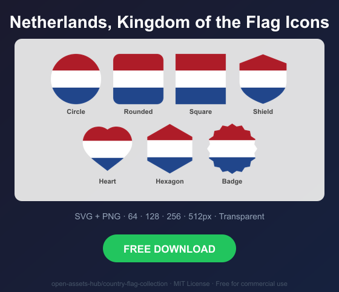
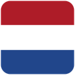
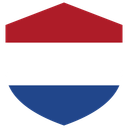
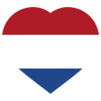
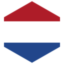
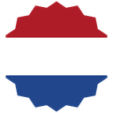

# Netherlands, Kingdom of the Flag Icons — Free SVG & PNG in 7 Shapes

Free Netherlands, Kingdom of the flag icons in 7 shapes. Transparent PNG (64, 128, 256, 512px) + SVG. Free for commercial use.

## Preview

      

## Download All Shapes

**[Download nl-flag-icons.zip](nl-flag-icons.zip)** — All 7 shapes, all sizes + SVG in one zip

## Download Individual

| Shape | SVG | 64px | 128px | 256px | 512px |
|---|---|---|---|---|---|
| Circle | [SVG](https://raw.githubusercontent.com/open-assets-hub/country-flag-collection/main/circle/svg/nl.svg) | [64](https://raw.githubusercontent.com/open-assets-hub/country-flag-collection/main/circle/64/nl.png) | [128](https://raw.githubusercontent.com/open-assets-hub/country-flag-collection/main/circle/128/nl.png) | [256](https://raw.githubusercontent.com/open-assets-hub/country-flag-collection/main/circle/256/nl.png) | [512](https://raw.githubusercontent.com/open-assets-hub/country-flag-collection/main/circle/512/nl.png) |
| Rounded | [SVG](https://raw.githubusercontent.com/open-assets-hub/country-flag-collection/main/rounded/svg/nl.svg) | [64](https://raw.githubusercontent.com/open-assets-hub/country-flag-collection/main/rounded/64/nl.png) | [128](https://raw.githubusercontent.com/open-assets-hub/country-flag-collection/main/rounded/128/nl.png) | [256](https://raw.githubusercontent.com/open-assets-hub/country-flag-collection/main/rounded/256/nl.png) | [512](https://raw.githubusercontent.com/open-assets-hub/country-flag-collection/main/rounded/512/nl.png) |
| Square | [SVG](https://raw.githubusercontent.com/open-assets-hub/country-flag-collection/main/square/svg/nl.svg) | [64](https://raw.githubusercontent.com/open-assets-hub/country-flag-collection/main/square/64/nl.png) | [128](https://raw.githubusercontent.com/open-assets-hub/country-flag-collection/main/square/128/nl.png) | [256](https://raw.githubusercontent.com/open-assets-hub/country-flag-collection/main/square/256/nl.png) | [512](https://raw.githubusercontent.com/open-assets-hub/country-flag-collection/main/square/512/nl.png) |
| Shield | [SVG](https://raw.githubusercontent.com/open-assets-hub/country-flag-collection/main/shield/svg/nl.svg) | [64](https://raw.githubusercontent.com/open-assets-hub/country-flag-collection/main/shield/64/nl.png) | [128](https://raw.githubusercontent.com/open-assets-hub/country-flag-collection/main/shield/128/nl.png) | [256](https://raw.githubusercontent.com/open-assets-hub/country-flag-collection/main/shield/256/nl.png) | [512](https://raw.githubusercontent.com/open-assets-hub/country-flag-collection/main/shield/512/nl.png) |
| Heart | [SVG](https://raw.githubusercontent.com/open-assets-hub/country-flag-collection/main/heart/svg/nl.svg) | [64](https://raw.githubusercontent.com/open-assets-hub/country-flag-collection/main/heart/64/nl.png) | [128](https://raw.githubusercontent.com/open-assets-hub/country-flag-collection/main/heart/128/nl.png) | [256](https://raw.githubusercontent.com/open-assets-hub/country-flag-collection/main/heart/256/nl.png) | [512](https://raw.githubusercontent.com/open-assets-hub/country-flag-collection/main/heart/512/nl.png) |
| Hexagon | [SVG](https://raw.githubusercontent.com/open-assets-hub/country-flag-collection/main/hexagon/svg/nl.svg) | [64](https://raw.githubusercontent.com/open-assets-hub/country-flag-collection/main/hexagon/64/nl.png) | [128](https://raw.githubusercontent.com/open-assets-hub/country-flag-collection/main/hexagon/128/nl.png) | [256](https://raw.githubusercontent.com/open-assets-hub/country-flag-collection/main/hexagon/256/nl.png) | [512](https://raw.githubusercontent.com/open-assets-hub/country-flag-collection/main/hexagon/512/nl.png) |
| Badge | [SVG](https://raw.githubusercontent.com/open-assets-hub/country-flag-collection/main/badge/svg/nl.svg) | [64](https://raw.githubusercontent.com/open-assets-hub/country-flag-collection/main/badge/64/nl.png) | [128](https://raw.githubusercontent.com/open-assets-hub/country-flag-collection/main/badge/128/nl.png) | [256](https://raw.githubusercontent.com/open-assets-hub/country-flag-collection/main/badge/256/nl.png) | [512](https://raw.githubusercontent.com/open-assets-hub/country-flag-collection/main/badge/512/nl.png) |

## Keywords

Netherlands, Kingdom of the flag icon, Netherlands, Kingdom of the flag png, Netherlands, Kingdom of the flag svg, Netherlands, Kingdom of the flag circle,
Netherlands, Kingdom of the flag rounded, Netherlands, Kingdom of the flag shield, Netherlands, Kingdom of the flag heart,
NL flag icon, free Netherlands, Kingdom of the flag download, Netherlands, Kingdom of the flag transparent png

[← All countries](../../README.md)
