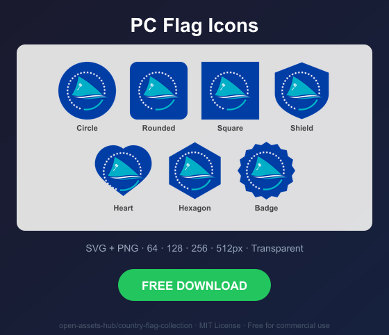

# PC Flag Icons — Free SVG & PNG in 7 Shapes

Free PC flag icons in 7 shapes. Transparent PNG (64, 128, 256, 512px) + SVG. Free for commercial use.

## Preview

      

## Download All Shapes

**[Download pc-flag-icons.zip](pc-flag-icons.zip)** — All 7 shapes, all sizes + SVG in one zip

## Download Individual

| Shape | SVG | 64px | 128px | 256px | 512px |
|---|---|---|---|---|---|
| Circle | [SVG](https://raw.githubusercontent.com/open-assets-hub/country-flag-collection/main/circle/svg/pc.svg) | [64](https://raw.githubusercontent.com/open-assets-hub/country-flag-collection/main/circle/64/pc.png) | [128](https://raw.githubusercontent.com/open-assets-hub/country-flag-collection/main/circle/128/pc.png) | [256](https://raw.githubusercontent.com/open-assets-hub/country-flag-collection/main/circle/256/pc.png) | [512](https://raw.githubusercontent.com/open-assets-hub/country-flag-collection/main/circle/512/pc.png) |
| Rounded | [SVG](https://raw.githubusercontent.com/open-assets-hub/country-flag-collection/main/rounded/svg/pc.svg) | [64](https://raw.githubusercontent.com/open-assets-hub/country-flag-collection/main/rounded/64/pc.png) | [128](https://raw.githubusercontent.com/open-assets-hub/country-flag-collection/main/rounded/128/pc.png) | [256](https://raw.githubusercontent.com/open-assets-hub/country-flag-collection/main/rounded/256/pc.png) | [512](https://raw.githubusercontent.com/open-assets-hub/country-flag-collection/main/rounded/512/pc.png) |
| Square | [SVG](https://raw.githubusercontent.com/open-assets-hub/country-flag-collection/main/square/svg/pc.svg) | [64](https://raw.githubusercontent.com/open-assets-hub/country-flag-collection/main/square/64/pc.png) | [128](https://raw.githubusercontent.com/open-assets-hub/country-flag-collection/main/square/128/pc.png) | [256](https://raw.githubusercontent.com/open-assets-hub/country-flag-collection/main/square/256/pc.png) | [512](https://raw.githubusercontent.com/open-assets-hub/country-flag-collection/main/square/512/pc.png) |
| Shield | [SVG](https://raw.githubusercontent.com/open-assets-hub/country-flag-collection/main/shield/svg/pc.svg) | [64](https://raw.githubusercontent.com/open-assets-hub/country-flag-collection/main/shield/64/pc.png) | [128](https://raw.githubusercontent.com/open-assets-hub/country-flag-collection/main/shield/128/pc.png) | [256](https://raw.githubusercontent.com/open-assets-hub/country-flag-collection/main/shield/256/pc.png) | [512](https://raw.githubusercontent.com/open-assets-hub/country-flag-collection/main/shield/512/pc.png) |
| Heart | [SVG](https://raw.githubusercontent.com/open-assets-hub/country-flag-collection/main/heart/svg/pc.svg) | [64](https://raw.githubusercontent.com/open-assets-hub/country-flag-collection/main/heart/64/pc.png) | [128](https://raw.githubusercontent.com/open-assets-hub/country-flag-collection/main/heart/128/pc.png) | [256](https://raw.githubusercontent.com/open-assets-hub/country-flag-collection/main/heart/256/pc.png) | [512](https://raw.githubusercontent.com/open-assets-hub/country-flag-collection/main/heart/512/pc.png) |
| Hexagon | [SVG](https://raw.githubusercontent.com/open-assets-hub/country-flag-collection/main/hexagon/svg/pc.svg) | [64](https://raw.githubusercontent.com/open-assets-hub/country-flag-collection/main/hexagon/64/pc.png) | [128](https://raw.githubusercontent.com/open-assets-hub/country-flag-collection/main/hexagon/128/pc.png) | [256](https://raw.githubusercontent.com/open-assets-hub/country-flag-collection/main/hexagon/256/pc.png) | [512](https://raw.githubusercontent.com/open-assets-hub/country-flag-collection/main/hexagon/512/pc.png) |
| Badge | [SVG](https://raw.githubusercontent.com/open-assets-hub/country-flag-collection/main/badge/svg/pc.svg) | [64](https://raw.githubusercontent.com/open-assets-hub/country-flag-collection/main/badge/64/pc.png) | [128](https://raw.githubusercontent.com/open-assets-hub/country-flag-collection/main/badge/128/pc.png) | [256](https://raw.githubusercontent.com/open-assets-hub/country-flag-collection/main/badge/256/pc.png) | [512](https://raw.githubusercontent.com/open-assets-hub/country-flag-collection/main/badge/512/pc.png) |

## Keywords

PC flag icon, PC flag png, PC flag svg, PC flag circle,
PC flag rounded, PC flag shield, PC flag heart,
PC flag icon, free PC flag download, PC flag transparent png

[← All countries](../../README.md)
