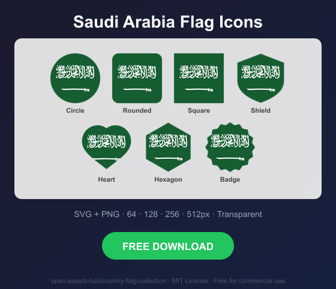

# Saudi Arabia Flag Icons — Free SVG & PNG in 7 Shapes

Free Saudi Arabia flag icons in 7 shapes. Transparent PNG (64, 128, 256, 512px) + SVG. Free for commercial use.

## Preview

      

## Download All Shapes

**[Download sa-flag-icons.zip](https://raw.githubusercontent.com/open-assets-hub/country-flag-collection/main/countries/sa/sa-flag-icons.zip)** — All 7 shapes, all sizes + SVG in one zip

## Download Individual

| Shape | SVG | 64px | 128px | 256px | 512px |
|---|---|---|---|---|---|
| Circle | [SVG](https://raw.githubusercontent.com/open-assets-hub/country-flag-collection/main/circle/svg/sa.svg) | [64](https://raw.githubusercontent.com/open-assets-hub/country-flag-collection/main/circle/64/sa.png) | [128](https://raw.githubusercontent.com/open-assets-hub/country-flag-collection/main/circle/128/sa.png) | [256](https://raw.githubusercontent.com/open-assets-hub/country-flag-collection/main/circle/256/sa.png) | [512](https://raw.githubusercontent.com/open-assets-hub/country-flag-collection/main/circle/512/sa.png) |
| Rounded | [SVG](https://raw.githubusercontent.com/open-assets-hub/country-flag-collection/main/rounded/svg/sa.svg) | [64](https://raw.githubusercontent.com/open-assets-hub/country-flag-collection/main/rounded/64/sa.png) | [128](https://raw.githubusercontent.com/open-assets-hub/country-flag-collection/main/rounded/128/sa.png) | [256](https://raw.githubusercontent.com/open-assets-hub/country-flag-collection/main/rounded/256/sa.png) | [512](https://raw.githubusercontent.com/open-assets-hub/country-flag-collection/main/rounded/512/sa.png) |
| Square | [SVG](https://raw.githubusercontent.com/open-assets-hub/country-flag-collection/main/square/svg/sa.svg) | [64](https://raw.githubusercontent.com/open-assets-hub/country-flag-collection/main/square/64/sa.png) | [128](https://raw.githubusercontent.com/open-assets-hub/country-flag-collection/main/square/128/sa.png) | [256](https://raw.githubusercontent.com/open-assets-hub/country-flag-collection/main/square/256/sa.png) | [512](https://raw.githubusercontent.com/open-assets-hub/country-flag-collection/main/square/512/sa.png) |
| Shield | [SVG](https://raw.githubusercontent.com/open-assets-hub/country-flag-collection/main/shield/svg/sa.svg) | [64](https://raw.githubusercontent.com/open-assets-hub/country-flag-collection/main/shield/64/sa.png) | [128](https://raw.githubusercontent.com/open-assets-hub/country-flag-collection/main/shield/128/sa.png) | [256](https://raw.githubusercontent.com/open-assets-hub/country-flag-collection/main/shield/256/sa.png) | [512](https://raw.githubusercontent.com/open-assets-hub/country-flag-collection/main/shield/512/sa.png) |
| Heart | [SVG](https://raw.githubusercontent.com/open-assets-hub/country-flag-collection/main/heart/svg/sa.svg) | [64](https://raw.githubusercontent.com/open-assets-hub/country-flag-collection/main/heart/64/sa.png) | [128](https://raw.githubusercontent.com/open-assets-hub/country-flag-collection/main/heart/128/sa.png) | [256](https://raw.githubusercontent.com/open-assets-hub/country-flag-collection/main/heart/256/sa.png) | [512](https://raw.githubusercontent.com/open-assets-hub/country-flag-collection/main/heart/512/sa.png) |
| Hexagon | [SVG](https://raw.githubusercontent.com/open-assets-hub/country-flag-collection/main/hexagon/svg/sa.svg) | [64](https://raw.githubusercontent.com/open-assets-hub/country-flag-collection/main/hexagon/64/sa.png) | [128](https://raw.githubusercontent.com/open-assets-hub/country-flag-collection/main/hexagon/128/sa.png) | [256](https://raw.githubusercontent.com/open-assets-hub/country-flag-collection/main/hexagon/256/sa.png) | [512](https://raw.githubusercontent.com/open-assets-hub/country-flag-collection/main/hexagon/512/sa.png) |
| Badge | [SVG](https://raw.githubusercontent.com/open-assets-hub/country-flag-collection/main/badge/svg/sa.svg) | [64](https://raw.githubusercontent.com/open-assets-hub/country-flag-collection/main/badge/64/sa.png) | [128](https://raw.githubusercontent.com/open-assets-hub/country-flag-collection/main/badge/128/sa.png) | [256](https://raw.githubusercontent.com/open-assets-hub/country-flag-collection/main/badge/256/sa.png) | [512](https://raw.githubusercontent.com/open-assets-hub/country-flag-collection/main/badge/512/sa.png) |

## Keywords

Saudi Arabia flag icon, Saudi Arabia flag png, Saudi Arabia flag svg, Saudi Arabia flag circle,
Saudi Arabia flag rounded, Saudi Arabia flag shield, Saudi Arabia flag heart,
SA flag icon, free Saudi Arabia flag download, Saudi Arabia flag transparent png

[← All countries](../../README.md)
