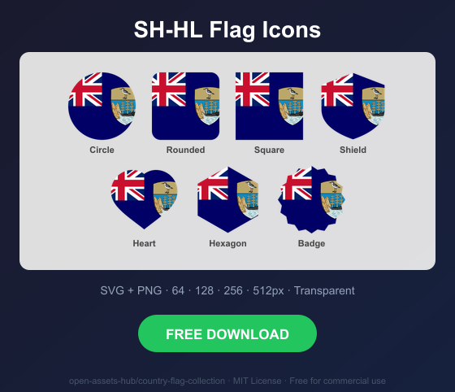
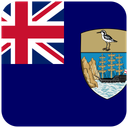
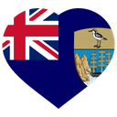
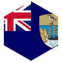

# SH-HL Flag Icons — Free SVG & PNG in 7 Shapes

Free SH-HL flag icons in 7 shapes. Transparent PNG (64, 128, 256, 512px) + SVG. Free for commercial use.

## Preview

      

## Download All Shapes

**[Download sh-hl-flag-icons.zip](sh-hl-flag-icons.zip)** — All 7 shapes, all sizes + SVG in one zip

## Download Individual

| Shape | SVG | 64px | 128px | 256px | 512px |
|---|---|---|---|---|---|
| Circle | [SVG](https://raw.githubusercontent.com/open-assets-hub/country-flag-collection/main/circle/svg/sh-hl.svg) | [64](https://raw.githubusercontent.com/open-assets-hub/country-flag-collection/main/circle/64/sh-hl.png) | [128](https://raw.githubusercontent.com/open-assets-hub/country-flag-collection/main/circle/128/sh-hl.png) | [256](https://raw.githubusercontent.com/open-assets-hub/country-flag-collection/main/circle/256/sh-hl.png) | [512](https://raw.githubusercontent.com/open-assets-hub/country-flag-collection/main/circle/512/sh-hl.png) |
| Rounded | [SVG](https://raw.githubusercontent.com/open-assets-hub/country-flag-collection/main/rounded/svg/sh-hl.svg) | [64](https://raw.githubusercontent.com/open-assets-hub/country-flag-collection/main/rounded/64/sh-hl.png) | [128](https://raw.githubusercontent.com/open-assets-hub/country-flag-collection/main/rounded/128/sh-hl.png) | [256](https://raw.githubusercontent.com/open-assets-hub/country-flag-collection/main/rounded/256/sh-hl.png) | [512](https://raw.githubusercontent.com/open-assets-hub/country-flag-collection/main/rounded/512/sh-hl.png) |
| Square | [SVG](https://raw.githubusercontent.com/open-assets-hub/country-flag-collection/main/square/svg/sh-hl.svg) | [64](https://raw.githubusercontent.com/open-assets-hub/country-flag-collection/main/square/64/sh-hl.png) | [128](https://raw.githubusercontent.com/open-assets-hub/country-flag-collection/main/square/128/sh-hl.png) | [256](https://raw.githubusercontent.com/open-assets-hub/country-flag-collection/main/square/256/sh-hl.png) | [512](https://raw.githubusercontent.com/open-assets-hub/country-flag-collection/main/square/512/sh-hl.png) |
| Shield | [SVG](https://raw.githubusercontent.com/open-assets-hub/country-flag-collection/main/shield/svg/sh-hl.svg) | [64](https://raw.githubusercontent.com/open-assets-hub/country-flag-collection/main/shield/64/sh-hl.png) | [128](https://raw.githubusercontent.com/open-assets-hub/country-flag-collection/main/shield/128/sh-hl.png) | [256](https://raw.githubusercontent.com/open-assets-hub/country-flag-collection/main/shield/256/sh-hl.png) | [512](https://raw.githubusercontent.com/open-assets-hub/country-flag-collection/main/shield/512/sh-hl.png) |
| Heart | [SVG](https://raw.githubusercontent.com/open-assets-hub/country-flag-collection/main/heart/svg/sh-hl.svg) | [64](https://raw.githubusercontent.com/open-assets-hub/country-flag-collection/main/heart/64/sh-hl.png) | [128](https://raw.githubusercontent.com/open-assets-hub/country-flag-collection/main/heart/128/sh-hl.png) | [256](https://raw.githubusercontent.com/open-assets-hub/country-flag-collection/main/heart/256/sh-hl.png) | [512](https://raw.githubusercontent.com/open-assets-hub/country-flag-collection/main/heart/512/sh-hl.png) |
| Hexagon | [SVG](https://raw.githubusercontent.com/open-assets-hub/country-flag-collection/main/hexagon/svg/sh-hl.svg) | [64](https://raw.githubusercontent.com/open-assets-hub/country-flag-collection/main/hexagon/64/sh-hl.png) | [128](https://raw.githubusercontent.com/open-assets-hub/country-flag-collection/main/hexagon/128/sh-hl.png) | [256](https://raw.githubusercontent.com/open-assets-hub/country-flag-collection/main/hexagon/256/sh-hl.png) | [512](https://raw.githubusercontent.com/open-assets-hub/country-flag-collection/main/hexagon/512/sh-hl.png) |
| Badge | [SVG](https://raw.githubusercontent.com/open-assets-hub/country-flag-collection/main/badge/svg/sh-hl.svg) | [64](https://raw.githubusercontent.com/open-assets-hub/country-flag-collection/main/badge/64/sh-hl.png) | [128](https://raw.githubusercontent.com/open-assets-hub/country-flag-collection/main/badge/128/sh-hl.png) | [256](https://raw.githubusercontent.com/open-assets-hub/country-flag-collection/main/badge/256/sh-hl.png) | [512](https://raw.githubusercontent.com/open-assets-hub/country-flag-collection/main/badge/512/sh-hl.png) |

## Keywords

SH-HL flag icon, SH-HL flag png, SH-HL flag svg, SH-HL flag circle,
SH-HL flag rounded, SH-HL flag shield, SH-HL flag heart,
SH-HL flag icon, free SH-HL flag download, SH-HL flag transparent png

[← All countries](../../README.md)
