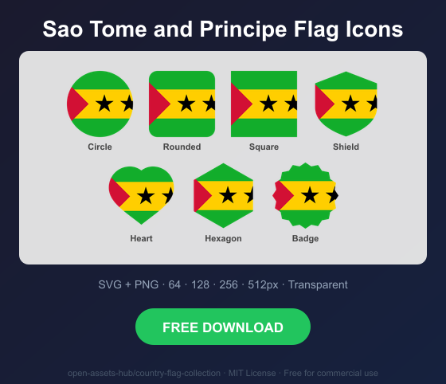
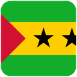
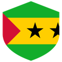
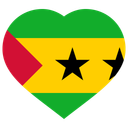
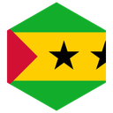

# Sao Tome and Principe Flag Icons — Free SVG & PNG in 7 Shapes

Free Sao Tome and Principe flag icons in 7 shapes. Transparent PNG (64, 128, 256, 512px) + SVG. Free for commercial use.

## Preview

      

## Download All Shapes

**[Download st-flag-icons.zip](https://raw.githubusercontent.com/open-assets-hub/country-flag-collection/main/countries/st/st-flag-icons.zip)** — All 7 shapes, all sizes + SVG in one zip

## Download Individual

| Shape | SVG | 64px | 128px | 256px | 512px |
|---|---|---|---|---|---|
| Circle | [SVG](https://raw.githubusercontent.com/open-assets-hub/country-flag-collection/main/circle/svg/st.svg) | [64](https://raw.githubusercontent.com/open-assets-hub/country-flag-collection/main/circle/64/st.png) | [128](https://raw.githubusercontent.com/open-assets-hub/country-flag-collection/main/circle/128/st.png) | [256](https://raw.githubusercontent.com/open-assets-hub/country-flag-collection/main/circle/256/st.png) | [512](https://raw.githubusercontent.com/open-assets-hub/country-flag-collection/main/circle/512/st.png) |
| Rounded | [SVG](https://raw.githubusercontent.com/open-assets-hub/country-flag-collection/main/rounded/svg/st.svg) | [64](https://raw.githubusercontent.com/open-assets-hub/country-flag-collection/main/rounded/64/st.png) | [128](https://raw.githubusercontent.com/open-assets-hub/country-flag-collection/main/rounded/128/st.png) | [256](https://raw.githubusercontent.com/open-assets-hub/country-flag-collection/main/rounded/256/st.png) | [512](https://raw.githubusercontent.com/open-assets-hub/country-flag-collection/main/rounded/512/st.png) |
| Square | [SVG](https://raw.githubusercontent.com/open-assets-hub/country-flag-collection/main/square/svg/st.svg) | [64](https://raw.githubusercontent.com/open-assets-hub/country-flag-collection/main/square/64/st.png) | [128](https://raw.githubusercontent.com/open-assets-hub/country-flag-collection/main/square/128/st.png) | [256](https://raw.githubusercontent.com/open-assets-hub/country-flag-collection/main/square/256/st.png) | [512](https://raw.githubusercontent.com/open-assets-hub/country-flag-collection/main/square/512/st.png) |
| Shield | [SVG](https://raw.githubusercontent.com/open-assets-hub/country-flag-collection/main/shield/svg/st.svg) | [64](https://raw.githubusercontent.com/open-assets-hub/country-flag-collection/main/shield/64/st.png) | [128](https://raw.githubusercontent.com/open-assets-hub/country-flag-collection/main/shield/128/st.png) | [256](https://raw.githubusercontent.com/open-assets-hub/country-flag-collection/main/shield/256/st.png) | [512](https://raw.githubusercontent.com/open-assets-hub/country-flag-collection/main/shield/512/st.png) |
| Heart | [SVG](https://raw.githubusercontent.com/open-assets-hub/country-flag-collection/main/heart/svg/st.svg) | [64](https://raw.githubusercontent.com/open-assets-hub/country-flag-collection/main/heart/64/st.png) | [128](https://raw.githubusercontent.com/open-assets-hub/country-flag-collection/main/heart/128/st.png) | [256](https://raw.githubusercontent.com/open-assets-hub/country-flag-collection/main/heart/256/st.png) | [512](https://raw.githubusercontent.com/open-assets-hub/country-flag-collection/main/heart/512/st.png) |
| Hexagon | [SVG](https://raw.githubusercontent.com/open-assets-hub/country-flag-collection/main/hexagon/svg/st.svg) | [64](https://raw.githubusercontent.com/open-assets-hub/country-flag-collection/main/hexagon/64/st.png) | [128](https://raw.githubusercontent.com/open-assets-hub/country-flag-collection/main/hexagon/128/st.png) | [256](https://raw.githubusercontent.com/open-assets-hub/country-flag-collection/main/hexagon/256/st.png) | [512](https://raw.githubusercontent.com/open-assets-hub/country-flag-collection/main/hexagon/512/st.png) |
| Badge | [SVG](https://raw.githubusercontent.com/open-assets-hub/country-flag-collection/main/badge/svg/st.svg) | [64](https://raw.githubusercontent.com/open-assets-hub/country-flag-collection/main/badge/64/st.png) | [128](https://raw.githubusercontent.com/open-assets-hub/country-flag-collection/main/badge/128/st.png) | [256](https://raw.githubusercontent.com/open-assets-hub/country-flag-collection/main/badge/256/st.png) | [512](https://raw.githubusercontent.com/open-assets-hub/country-flag-collection/main/badge/512/st.png) |

## Keywords

Sao Tome and Principe flag icon, Sao Tome and Principe flag png, Sao Tome and Principe flag svg, Sao Tome and Principe flag circle,
Sao Tome and Principe flag rounded, Sao Tome and Principe flag shield, Sao Tome and Principe flag heart,
ST flag icon, free Sao Tome and Principe flag download, Sao Tome and Principe flag transparent png

[← All countries](../../README.md)
