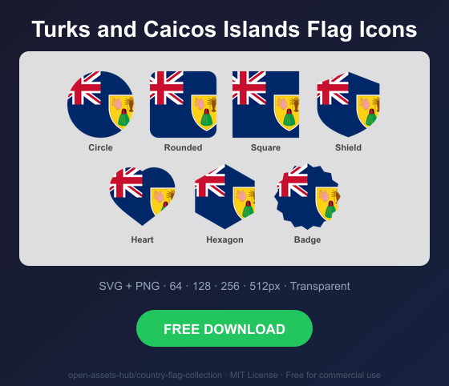
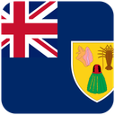
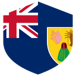
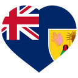
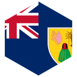
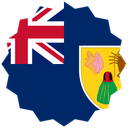

# Turks and Caicos Islands Flag Icons — Free SVG & PNG in 7 Shapes

Free Turks and Caicos Islands flag icons in 7 shapes. Transparent PNG (64, 128, 256, 512px) + SVG. Free for commercial use.

## Preview

      

## Download All Shapes

**[Download tc-flag-icons.zip](https://raw.githubusercontent.com/open-assets-hub/country-flag-collection/main/countries/tc/tc-flag-icons.zip)** — All 7 shapes, all sizes + SVG in one zip

## Download Individual

| Shape | SVG | 64px | 128px | 256px | 512px |
|---|---|---|---|---|---|
| Circle | [SVG](https://raw.githubusercontent.com/open-assets-hub/country-flag-collection/main/circle/svg/tc.svg) | [64](https://raw.githubusercontent.com/open-assets-hub/country-flag-collection/main/circle/64/tc.png) | [128](https://raw.githubusercontent.com/open-assets-hub/country-flag-collection/main/circle/128/tc.png) | [256](https://raw.githubusercontent.com/open-assets-hub/country-flag-collection/main/circle/256/tc.png) | [512](https://raw.githubusercontent.com/open-assets-hub/country-flag-collection/main/circle/512/tc.png) |
| Rounded | [SVG](https://raw.githubusercontent.com/open-assets-hub/country-flag-collection/main/rounded/svg/tc.svg) | [64](https://raw.githubusercontent.com/open-assets-hub/country-flag-collection/main/rounded/64/tc.png) | [128](https://raw.githubusercontent.com/open-assets-hub/country-flag-collection/main/rounded/128/tc.png) | [256](https://raw.githubusercontent.com/open-assets-hub/country-flag-collection/main/rounded/256/tc.png) | [512](https://raw.githubusercontent.com/open-assets-hub/country-flag-collection/main/rounded/512/tc.png) |
| Square | [SVG](https://raw.githubusercontent.com/open-assets-hub/country-flag-collection/main/square/svg/tc.svg) | [64](https://raw.githubusercontent.com/open-assets-hub/country-flag-collection/main/square/64/tc.png) | [128](https://raw.githubusercontent.com/open-assets-hub/country-flag-collection/main/square/128/tc.png) | [256](https://raw.githubusercontent.com/open-assets-hub/country-flag-collection/main/square/256/tc.png) | [512](https://raw.githubusercontent.com/open-assets-hub/country-flag-collection/main/square/512/tc.png) |
| Shield | [SVG](https://raw.githubusercontent.com/open-assets-hub/country-flag-collection/main/shield/svg/tc.svg) | [64](https://raw.githubusercontent.com/open-assets-hub/country-flag-collection/main/shield/64/tc.png) | [128](https://raw.githubusercontent.com/open-assets-hub/country-flag-collection/main/shield/128/tc.png) | [256](https://raw.githubusercontent.com/open-assets-hub/country-flag-collection/main/shield/256/tc.png) | [512](https://raw.githubusercontent.com/open-assets-hub/country-flag-collection/main/shield/512/tc.png) |
| Heart | [SVG](https://raw.githubusercontent.com/open-assets-hub/country-flag-collection/main/heart/svg/tc.svg) | [64](https://raw.githubusercontent.com/open-assets-hub/country-flag-collection/main/heart/64/tc.png) | [128](https://raw.githubusercontent.com/open-assets-hub/country-flag-collection/main/heart/128/tc.png) | [256](https://raw.githubusercontent.com/open-assets-hub/country-flag-collection/main/heart/256/tc.png) | [512](https://raw.githubusercontent.com/open-assets-hub/country-flag-collection/main/heart/512/tc.png) |
| Hexagon | [SVG](https://raw.githubusercontent.com/open-assets-hub/country-flag-collection/main/hexagon/svg/tc.svg) | [64](https://raw.githubusercontent.com/open-assets-hub/country-flag-collection/main/hexagon/64/tc.png) | [128](https://raw.githubusercontent.com/open-assets-hub/country-flag-collection/main/hexagon/128/tc.png) | [256](https://raw.githubusercontent.com/open-assets-hub/country-flag-collection/main/hexagon/256/tc.png) | [512](https://raw.githubusercontent.com/open-assets-hub/country-flag-collection/main/hexagon/512/tc.png) |
| Badge | [SVG](https://raw.githubusercontent.com/open-assets-hub/country-flag-collection/main/badge/svg/tc.svg) | [64](https://raw.githubusercontent.com/open-assets-hub/country-flag-collection/main/badge/64/tc.png) | [128](https://raw.githubusercontent.com/open-assets-hub/country-flag-collection/main/badge/128/tc.png) | [256](https://raw.githubusercontent.com/open-assets-hub/country-flag-collection/main/badge/256/tc.png) | [512](https://raw.githubusercontent.com/open-assets-hub/country-flag-collection/main/badge/512/tc.png) |

## Keywords

Turks and Caicos Islands flag icon, Turks and Caicos Islands flag png, Turks and Caicos Islands flag svg, Turks and Caicos Islands flag circle,
Turks and Caicos Islands flag rounded, Turks and Caicos Islands flag shield, Turks and Caicos Islands flag heart,
TC flag icon, free Turks and Caicos Islands flag download, Turks and Caicos Islands flag transparent png

[← All countries](../../README.md)
