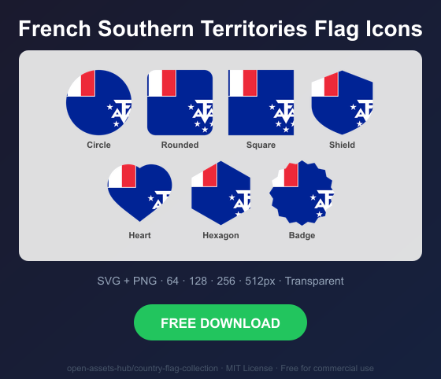
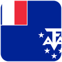
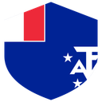
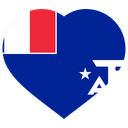
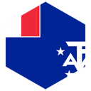
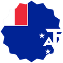

# French Southern Territories Flag Icons — Free SVG & PNG in 7 Shapes

Free French Southern Territories flag icons in 7 shapes. Transparent PNG (64, 128, 256, 512px) + SVG. Free for commercial use.

## Preview

      

## Download All Shapes

**[Download tf-flag-icons.zip](tf-flag-icons.zip)** — All 7 shapes, all sizes + SVG in one zip

## Download Individual

| Shape | SVG | 64px | 128px | 256px | 512px |
|---|---|---|---|---|---|
| Circle | [SVG](https://raw.githubusercontent.com/open-assets-hub/country-flag-collection/main/circle/svg/tf.svg) | [64](https://raw.githubusercontent.com/open-assets-hub/country-flag-collection/main/circle/64/tf.png) | [128](https://raw.githubusercontent.com/open-assets-hub/country-flag-collection/main/circle/128/tf.png) | [256](https://raw.githubusercontent.com/open-assets-hub/country-flag-collection/main/circle/256/tf.png) | [512](https://raw.githubusercontent.com/open-assets-hub/country-flag-collection/main/circle/512/tf.png) |
| Rounded | [SVG](https://raw.githubusercontent.com/open-assets-hub/country-flag-collection/main/rounded/svg/tf.svg) | [64](https://raw.githubusercontent.com/open-assets-hub/country-flag-collection/main/rounded/64/tf.png) | [128](https://raw.githubusercontent.com/open-assets-hub/country-flag-collection/main/rounded/128/tf.png) | [256](https://raw.githubusercontent.com/open-assets-hub/country-flag-collection/main/rounded/256/tf.png) | [512](https://raw.githubusercontent.com/open-assets-hub/country-flag-collection/main/rounded/512/tf.png) |
| Square | [SVG](https://raw.githubusercontent.com/open-assets-hub/country-flag-collection/main/square/svg/tf.svg) | [64](https://raw.githubusercontent.com/open-assets-hub/country-flag-collection/main/square/64/tf.png) | [128](https://raw.githubusercontent.com/open-assets-hub/country-flag-collection/main/square/128/tf.png) | [256](https://raw.githubusercontent.com/open-assets-hub/country-flag-collection/main/square/256/tf.png) | [512](https://raw.githubusercontent.com/open-assets-hub/country-flag-collection/main/square/512/tf.png) |
| Shield | [SVG](https://raw.githubusercontent.com/open-assets-hub/country-flag-collection/main/shield/svg/tf.svg) | [64](https://raw.githubusercontent.com/open-assets-hub/country-flag-collection/main/shield/64/tf.png) | [128](https://raw.githubusercontent.com/open-assets-hub/country-flag-collection/main/shield/128/tf.png) | [256](https://raw.githubusercontent.com/open-assets-hub/country-flag-collection/main/shield/256/tf.png) | [512](https://raw.githubusercontent.com/open-assets-hub/country-flag-collection/main/shield/512/tf.png) |
| Heart | [SVG](https://raw.githubusercontent.com/open-assets-hub/country-flag-collection/main/heart/svg/tf.svg) | [64](https://raw.githubusercontent.com/open-assets-hub/country-flag-collection/main/heart/64/tf.png) | [128](https://raw.githubusercontent.com/open-assets-hub/country-flag-collection/main/heart/128/tf.png) | [256](https://raw.githubusercontent.com/open-assets-hub/country-flag-collection/main/heart/256/tf.png) | [512](https://raw.githubusercontent.com/open-assets-hub/country-flag-collection/main/heart/512/tf.png) |
| Hexagon | [SVG](https://raw.githubusercontent.com/open-assets-hub/country-flag-collection/main/hexagon/svg/tf.svg) | [64](https://raw.githubusercontent.com/open-assets-hub/country-flag-collection/main/hexagon/64/tf.png) | [128](https://raw.githubusercontent.com/open-assets-hub/country-flag-collection/main/hexagon/128/tf.png) | [256](https://raw.githubusercontent.com/open-assets-hub/country-flag-collection/main/hexagon/256/tf.png) | [512](https://raw.githubusercontent.com/open-assets-hub/country-flag-collection/main/hexagon/512/tf.png) |
| Badge | [SVG](https://raw.githubusercontent.com/open-assets-hub/country-flag-collection/main/badge/svg/tf.svg) | [64](https://raw.githubusercontent.com/open-assets-hub/country-flag-collection/main/badge/64/tf.png) | [128](https://raw.githubusercontent.com/open-assets-hub/country-flag-collection/main/badge/128/tf.png) | [256](https://raw.githubusercontent.com/open-assets-hub/country-flag-collection/main/badge/256/tf.png) | [512](https://raw.githubusercontent.com/open-assets-hub/country-flag-collection/main/badge/512/tf.png) |

## Keywords

French Southern Territories flag icon, French Southern Territories flag png, French Southern Territories flag svg, French Southern Territories flag circle,
French Southern Territories flag rounded, French Southern Territories flag shield, French Southern Territories flag heart,
TF flag icon, free French Southern Territories flag download, French Southern Territories flag transparent png

[← All countries](../../README.md)
