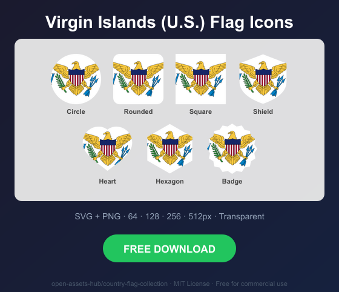
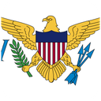
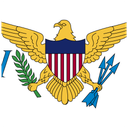
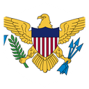
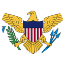
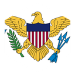
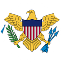

# Virgin Islands (U.S.) Flag Icons — Free SVG & PNG in 7 Shapes

Free Virgin Islands (U.S.) flag icons in 7 shapes. Transparent PNG (64, 128, 256, 512px) + SVG. Free for commercial use.

## Preview

      

## Download All Shapes

**[Download vi-flag-icons.zip](vi-flag-icons.zip)** — All 7 shapes, all sizes + SVG in one zip

## Download Individual

| Shape | SVG | 64px | 128px | 256px | 512px |
|---|---|---|---|---|---|
| Circle | [SVG](https://raw.githubusercontent.com/open-assets-hub/country-flag-collection/main/circle/svg/vi.svg) | [64](https://raw.githubusercontent.com/open-assets-hub/country-flag-collection/main/circle/64/vi.png) | [128](https://raw.githubusercontent.com/open-assets-hub/country-flag-collection/main/circle/128/vi.png) | [256](https://raw.githubusercontent.com/open-assets-hub/country-flag-collection/main/circle/256/vi.png) | [512](https://raw.githubusercontent.com/open-assets-hub/country-flag-collection/main/circle/512/vi.png) |
| Rounded | [SVG](https://raw.githubusercontent.com/open-assets-hub/country-flag-collection/main/rounded/svg/vi.svg) | [64](https://raw.githubusercontent.com/open-assets-hub/country-flag-collection/main/rounded/64/vi.png) | [128](https://raw.githubusercontent.com/open-assets-hub/country-flag-collection/main/rounded/128/vi.png) | [256](https://raw.githubusercontent.com/open-assets-hub/country-flag-collection/main/rounded/256/vi.png) | [512](https://raw.githubusercontent.com/open-assets-hub/country-flag-collection/main/rounded/512/vi.png) |
| Square | [SVG](https://raw.githubusercontent.com/open-assets-hub/country-flag-collection/main/square/svg/vi.svg) | [64](https://raw.githubusercontent.com/open-assets-hub/country-flag-collection/main/square/64/vi.png) | [128](https://raw.githubusercontent.com/open-assets-hub/country-flag-collection/main/square/128/vi.png) | [256](https://raw.githubusercontent.com/open-assets-hub/country-flag-collection/main/square/256/vi.png) | [512](https://raw.githubusercontent.com/open-assets-hub/country-flag-collection/main/square/512/vi.png) |
| Shield | [SVG](https://raw.githubusercontent.com/open-assets-hub/country-flag-collection/main/shield/svg/vi.svg) | [64](https://raw.githubusercontent.com/open-assets-hub/country-flag-collection/main/shield/64/vi.png) | [128](https://raw.githubusercontent.com/open-assets-hub/country-flag-collection/main/shield/128/vi.png) | [256](https://raw.githubusercontent.com/open-assets-hub/country-flag-collection/main/shield/256/vi.png) | [512](https://raw.githubusercontent.com/open-assets-hub/country-flag-collection/main/shield/512/vi.png) |
| Heart | [SVG](https://raw.githubusercontent.com/open-assets-hub/country-flag-collection/main/heart/svg/vi.svg) | [64](https://raw.githubusercontent.com/open-assets-hub/country-flag-collection/main/heart/64/vi.png) | [128](https://raw.githubusercontent.com/open-assets-hub/country-flag-collection/main/heart/128/vi.png) | [256](https://raw.githubusercontent.com/open-assets-hub/country-flag-collection/main/heart/256/vi.png) | [512](https://raw.githubusercontent.com/open-assets-hub/country-flag-collection/main/heart/512/vi.png) |
| Hexagon | [SVG](https://raw.githubusercontent.com/open-assets-hub/country-flag-collection/main/hexagon/svg/vi.svg) | [64](https://raw.githubusercontent.com/open-assets-hub/country-flag-collection/main/hexagon/64/vi.png) | [128](https://raw.githubusercontent.com/open-assets-hub/country-flag-collection/main/hexagon/128/vi.png) | [256](https://raw.githubusercontent.com/open-assets-hub/country-flag-collection/main/hexagon/256/vi.png) | [512](https://raw.githubusercontent.com/open-assets-hub/country-flag-collection/main/hexagon/512/vi.png) |
| Badge | [SVG](https://raw.githubusercontent.com/open-assets-hub/country-flag-collection/main/badge/svg/vi.svg) | [64](https://raw.githubusercontent.com/open-assets-hub/country-flag-collection/main/badge/64/vi.png) | [128](https://raw.githubusercontent.com/open-assets-hub/country-flag-collection/main/badge/128/vi.png) | [256](https://raw.githubusercontent.com/open-assets-hub/country-flag-collection/main/badge/256/vi.png) | [512](https://raw.githubusercontent.com/open-assets-hub/country-flag-collection/main/badge/512/vi.png) |

## Keywords

Virgin Islands (U.S.) flag icon, Virgin Islands (U.S.) flag png, Virgin Islands (U.S.) flag svg, Virgin Islands (U.S.) flag circle,
Virgin Islands (U.S.) flag rounded, Virgin Islands (U.S.) flag shield, Virgin Islands (U.S.) flag heart,
VI flag icon, free Virgin Islands (U.S.) flag download, Virgin Islands (U.S.) flag transparent png

[← All countries](../../README.md)
