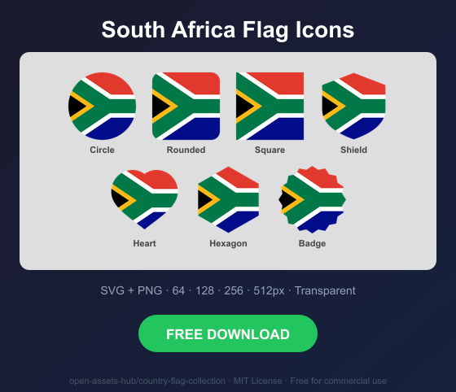
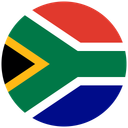
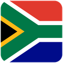
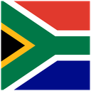
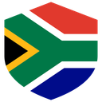
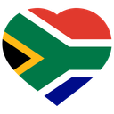
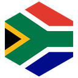
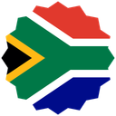

# South Africa Flag Icons — Free SVG & PNG in 7 Shapes

Free South Africa flag icons in 7 shapes. Transparent PNG (64, 128, 256, 512px) + SVG. Free for commercial use.

## Preview

      

## Download All Shapes

**[Download za-flag-icons.zip](https://raw.githubusercontent.com/open-assets-hub/country-flag-collection/main/countries/za/za-flag-icons.zip)** — All 7 shapes, all sizes + SVG in one zip

## Download Individual

| Shape | SVG | 64px | 128px | 256px | 512px |
|---|---|---|---|---|---|
| Circle | [SVG](https://raw.githubusercontent.com/open-assets-hub/country-flag-collection/main/circle/svg/za.svg) | [64](https://raw.githubusercontent.com/open-assets-hub/country-flag-collection/main/circle/64/za.png) | [128](https://raw.githubusercontent.com/open-assets-hub/country-flag-collection/main/circle/128/za.png) | [256](https://raw.githubusercontent.com/open-assets-hub/country-flag-collection/main/circle/256/za.png) | [512](https://raw.githubusercontent.com/open-assets-hub/country-flag-collection/main/circle/512/za.png) |
| Rounded | [SVG](https://raw.githubusercontent.com/open-assets-hub/country-flag-collection/main/rounded/svg/za.svg) | [64](https://raw.githubusercontent.com/open-assets-hub/country-flag-collection/main/rounded/64/za.png) | [128](https://raw.githubusercontent.com/open-assets-hub/country-flag-collection/main/rounded/128/za.png) | [256](https://raw.githubusercontent.com/open-assets-hub/country-flag-collection/main/rounded/256/za.png) | [512](https://raw.githubusercontent.com/open-assets-hub/country-flag-collection/main/rounded/512/za.png) |
| Square | [SVG](https://raw.githubusercontent.com/open-assets-hub/country-flag-collection/main/square/svg/za.svg) | [64](https://raw.githubusercontent.com/open-assets-hub/country-flag-collection/main/square/64/za.png) | [128](https://raw.githubusercontent.com/open-assets-hub/country-flag-collection/main/square/128/za.png) | [256](https://raw.githubusercontent.com/open-assets-hub/country-flag-collection/main/square/256/za.png) | [512](https://raw.githubusercontent.com/open-assets-hub/country-flag-collection/main/square/512/za.png) |
| Shield | [SVG](https://raw.githubusercontent.com/open-assets-hub/country-flag-collection/main/shield/svg/za.svg) | [64](https://raw.githubusercontent.com/open-assets-hub/country-flag-collection/main/shield/64/za.png) | [128](https://raw.githubusercontent.com/open-assets-hub/country-flag-collection/main/shield/128/za.png) | [256](https://raw.githubusercontent.com/open-assets-hub/country-flag-collection/main/shield/256/za.png) | [512](https://raw.githubusercontent.com/open-assets-hub/country-flag-collection/main/shield/512/za.png) |
| Heart | [SVG](https://raw.githubusercontent.com/open-assets-hub/country-flag-collection/main/heart/svg/za.svg) | [64](https://raw.githubusercontent.com/open-assets-hub/country-flag-collection/main/heart/64/za.png) | [128](https://raw.githubusercontent.com/open-assets-hub/country-flag-collection/main/heart/128/za.png) | [256](https://raw.githubusercontent.com/open-assets-hub/country-flag-collection/main/heart/256/za.png) | [512](https://raw.githubusercontent.com/open-assets-hub/country-flag-collection/main/heart/512/za.png) |
| Hexagon | [SVG](https://raw.githubusercontent.com/open-assets-hub/country-flag-collection/main/hexagon/svg/za.svg) | [64](https://raw.githubusercontent.com/open-assets-hub/country-flag-collection/main/hexagon/64/za.png) | [128](https://raw.githubusercontent.com/open-assets-hub/country-flag-collection/main/hexagon/128/za.png) | [256](https://raw.githubusercontent.com/open-assets-hub/country-flag-collection/main/hexagon/256/za.png) | [512](https://raw.githubusercontent.com/open-assets-hub/country-flag-collection/main/hexagon/512/za.png) |
| Badge | [SVG](https://raw.githubusercontent.com/open-assets-hub/country-flag-collection/main/badge/svg/za.svg) | [64](https://raw.githubusercontent.com/open-assets-hub/country-flag-collection/main/badge/64/za.png) | [128](https://raw.githubusercontent.com/open-assets-hub/country-flag-collection/main/badge/128/za.png) | [256](https://raw.githubusercontent.com/open-assets-hub/country-flag-collection/main/badge/256/za.png) | [512](https://raw.githubusercontent.com/open-assets-hub/country-flag-collection/main/badge/512/za.png) |

## Keywords

South Africa flag icon, South Africa flag png, South Africa flag svg, South Africa flag circle,
South Africa flag rounded, South Africa flag shield, South Africa flag heart,
ZA flag icon, free South Africa flag download, South Africa flag transparent png

[← All countries](../../README.md)
