# Square Country Flag Icons — Free SVG & PNG (271 Countries)

Free square-shaped country flag icons for 271 countries. Transparent PNG in 64, 128, 256, 512px + SVG. Free for commercial use.

## Preview — All 271 Flags

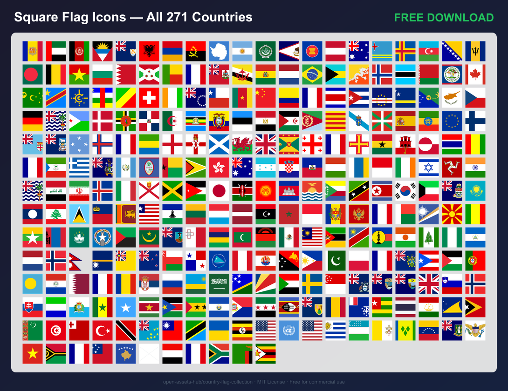

## All Flags

| | | | | | | | | | |
|---|---|---|---|---|---|---|---|---|---|
| 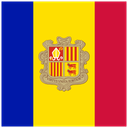 | 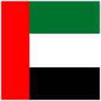 | 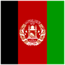 | 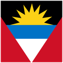 | 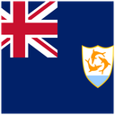 | 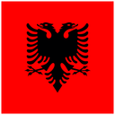 | 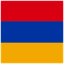 | 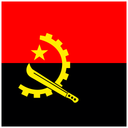 | 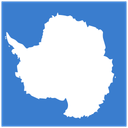 | 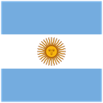 |
|  | 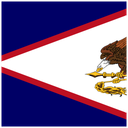 | 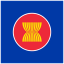 | 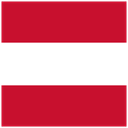 |  | 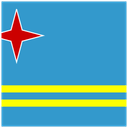 | 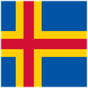 | 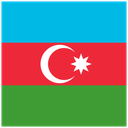 | 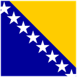 | 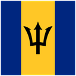 |
| 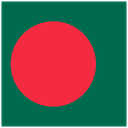 | 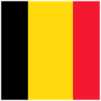 | 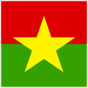 | 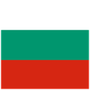 | 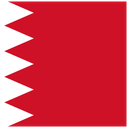 | 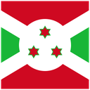 | 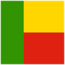 |  |  | 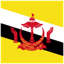 |
| 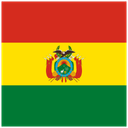 | 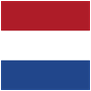 | 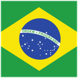 |  | 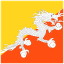 | 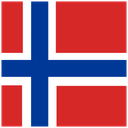 | 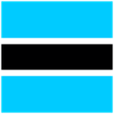 | 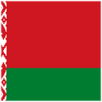 | 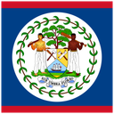 |  |
|  Islands") | 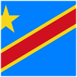 |  | 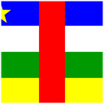 | 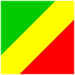 | 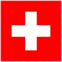 | 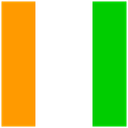 | 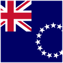 | 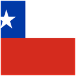 | 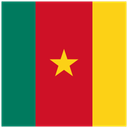 |
|  | 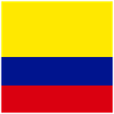 |  | 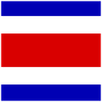 | 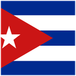 | 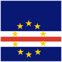 | 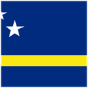 | 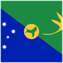 | 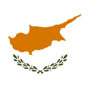 |  |
|  |  |  |  |  |  |  |  |  |  |
|  |  |  |  |  |  |  |  |  |  |
|  | ") |  |  |  |  |  |  |  |  |
|  |  |  |  |  |  |  |  |  |  |
|  |  |  |  |  |  |  |  |  |  |
|  |  |  |  |  |  |  |  |  |  |
|  |  |  |  |  |  |  |  |  |  |
|  |  |  |  |  |  |  |  |  |  |
|  |  |  |  |  |  |  |  |  |  |
|  |  |  |  |  | ") |  |  |  |  |
|  |  |  |  |  |  |  |  |  |  |
|  |  |  |  |  |  |  |  |  |  |
|  |  |  |  |  |  |  |  |  |  |
|  |  |  |  |  |  |  |  |  |  |
|  |  |  |  |  |  |  |  |  |  |
|  |  |  |  |  |  |  |  |  |  |
|  |  |  |  |  |  |  |  |  | ") |
|  |  |  |  |  |  |  |  |  |  |
|  |  |  |  |  |  |  |  |  |  |
|  |  |  |  |  |  |  |  | ") | ") |
|  |  |  |  |  |  |  |  |  |  |
|  |  |  |  |  |  |  |  |  |  |

## Download

| Format | Size | Download |
|---|---|---|
| SVG | vector | [square-svg.zip](https://github.com/open-assets-hub/country-flag-collection/releases/download/square-v1.0.0/square-svg.zip) |
| PNG 64px | 64×64 | [square-64.zip](https://github.com/open-assets-hub/country-flag-collection/releases/download/square-v1.0.0/square-64.zip) |
| PNG 128px | 128×128 | [square-128.zip](https://github.com/open-assets-hub/country-flag-collection/releases/download/square-v1.0.0/square-128.zip) |
| PNG 256px | 256×256 | [square-256.zip](https://github.com/open-assets-hub/country-flag-collection/releases/download/square-v1.0.0/square-256.zip) |
| PNG 512px | 512×512 | [square-512.zip](https://github.com/open-assets-hub/country-flag-collection/releases/download/square-v1.0.0/square-512.zip) |
| **All sizes** | SVG + PNG | [**square-full.zip**](https://github.com/open-assets-hub/country-flag-collection/releases/download/square-v1.0.0/square-full.zip) |

## License

Flag SVGs from [lipis/flag-icons](https://github.com/lipis/flag-icons) (MIT License). Free for personal and commercial use.

[← All shapes](../README.md)
